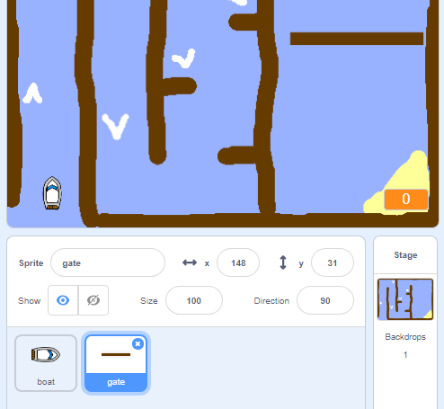

## እንቅፋቶችና ተነሳሽነት

አሁኑኑ ጨዋታ ነው **እስከ** እናንተ ይበልጥ ሳቢ እንዲሆን አንዳንድ ነገሮችን ያክላል ስለዚህ, በጣም ቀላል ነው.

በመጀመሪያ, ጀልባውን ለማፋጠን አንዳንድ ድጋፎችን ያካትታሉ.

\--- ተግባር \---

በአንዳንድ ነጭ boosters ቀስቶችን በማከል ደረጃ የደረጃዎችዎን ያርትዑ.


\--- / task \---

\--- ተግባር \---

አሁን የመርከብ ጀልባዎች አንድ ነጭ ፍላፊ በሚያነጣበት ጊዜ የጀልባ ስፓርተር ሶስት ተጨማሪ እርምጃዎች እንዲንቀሳቀስ ለማድረግ በመርከብ ጀርባ `ኡመት`{: class = "block3control"} ላይ ተጨማሪ የቁጥር ስፖሎችን ያክሉ. 

```blocks3
( <touching color [#FFFFFF] ?> ከዚያም (
) ን (3) እርምጃዎች
(3) መውሰድ
```

\--- / task \---

\--- ተግባር \---

አዲሶቹ መፋቂያዎች ፍላጻው በጀልባው በፍጥነት መጨመሩን ለማየት ጨዋታዎን ይሞክሩት.

\--- / task \---

በመቀጠል ጀልባው ሊጥለው የሚገባውን የተጣለፈው በር ይጫናል.

\--- ተግባር \---

ይህን የሚመስለውን አዲስ ስፔል አክል እና 'በር' ብለው ይጠሩት:



የበርፕለር ስእል ቀለም ከእንጨት መሰንያዎች ቀለም ጋር ተመሳሳይ መሆኑን ያረጋግጡ.


\--- /task \---

\--- task \---

Make sure that the centre of the gate sprite is positioned in the middle.


\--- /task \---

\--- task \---

Add code to your gate sprite to make it spin slowly forever.

\--- hints \--- \--- hint \--- Add code blocks to the gate sprite so that it `turns 1 degree`{:class="block3motion"} `forever`{:class="block3control"}. \--- /hint \--- \--- hint \--- Here are the code blocks you need: 

```blocks3
ጠቋሚ ሲጫወት ለዘለዓለም
መጨረሻ

ዞር (1 ዲግሪ

)
```

\--- /hint \--- \--- hint \--- Here's what your new code should look like: 

```blocks3
አውድ በ

ለጊዜው 1 ነጥብ c (1) ዲግሪ
መጨረሻ
```

\--- /hint \--- \--- /hints \---

\--- /task \---

\--- task \---

Test your game again. You should now have a spinning gate that you need to stir your boat around.


\--- /task \---