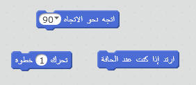
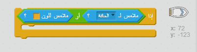

--- challenge ---

## التحدي: عوائق أخرى!
هل يمكنك إضافة عوائق أخرى إلى اللعبة؟ فيما يلي بعض الأفكار:

+ يمكنك إضافة مساحات خضراء لزجة بالخلفية وإجراء تغييرات على اللعبة بحيث تبطئ المساحات اللزجة من سرعة القارب عندما يسمح اللاعب بمرور القارب عليها.

--- hints ---
--- hint ---
يمكنك استخدام قالب `wait` لإجراء ذلك:

--- /hint ---
--- /hints ---

+ يمكنك إضافة كائن متحرك كلوح خشب أو سمكة قرش!

--- hints ---
--- hint ---
قد تساعدك هذه القوالب على تحريك الكائن الجديد:

إذا لم يكن كائنك الجديد بني اللون، فستحتاج إلى إضافته إلى التعليمة البرمجية للقارب:

--- /hint ---
--- /hints ---

--- /challenge ---
