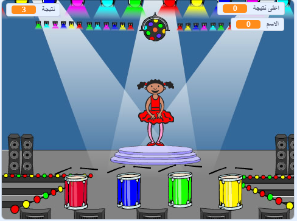

## ما التالي؟

Congratulations on completing the 'Boat race' project! Would you like to try something a little more challenging?

You could try out the [Memory](https://projects.raspberrypi.org/en/projects/memory?utm_source=pathway&utm_medium=whatnext&utm_campaign=projects) project.

\--- no-print \--- انقر على العلم الأخضر للبدء. شاهد تسلسل الألوان الذي يظهر به ثوب الراقصة واستمع إلى دقات الطبلة المصاحبة ، ثم قم بتكرار الألوان مرة آخرى رداً عليها. إذا ادخلت ترتيب الألوان بشكل خاطئ، فإنها نهاية اللعبة!

  <iframe allowtransparency="true" width="485" height="402" src="//scratch.mit.edu/projects/embed/284452634/?autostart=false" frameborder="0" allowfullscreen scrolling="no" mark="crwd-mark"></iframe> 

\--- /no-print \---

\--- print-only \---  \--- /print-only \---