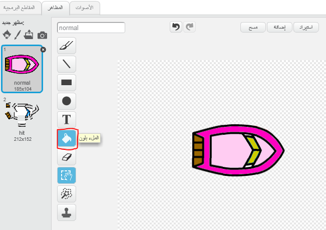
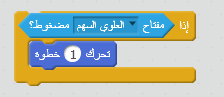

\--- challenge \---

## التحدي: قوارب أخرى!

هل يمكنك تحويل اللعبة لتصبح سباقًا بين لاعبين؟ سيحتاج اللاعب الثاني إلى التحكم في قاربه باستخدام السهم للأعلى للمضي قدمًا ومفتاحي السهم الأيمن والأيسر للإنعطاف.

\--- hints \--- \--- hint \--- نسخ القارب وتغيير لون القارب الثاني.

 \--- /hint \--- \--- hint \--- اجعل القاربَين يبدآن في مكانَين مختلفَين بتغيير التعليمة البرمجية هذه:

 \--- /hint \--- \--- hint \--- احذف التعليمة البرمجية للقارب2 التي تستخدم الفأرة واستبدلها بتعليمة برمجية للتحكم في القارب2 باستخدام مفاتيح الأسهم. \--- hint/ \--- \--- hint \--- هذه هي التعليمة البرمجية التي ستحتاج إليها لتحريك القارب2 إلى الأمام:

 \--- /hint \--- \--- hint \--- ستحتاج أيضًا إلى تعليمة برمجية *لتوجيه* القارب عند الضغط على مفاتيح الأسهم اليسرى واليمنى. \--- /hint \--- \--- /hints \---

\--- /challenge \---