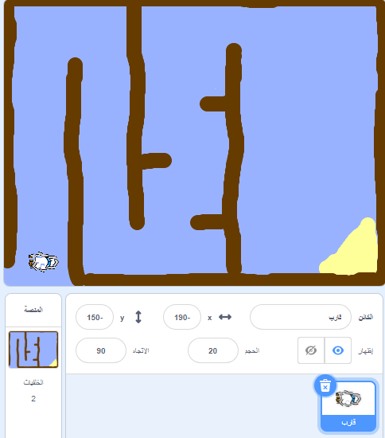

## بدء المشروع

+ افتح مشرع البدء.

--- collapse ---
---
title: أنا أستخدم برنامج Scratch عبر الإنترنت
image: images/image.png
---
افتح مشروع بدء 'سباق القوارب' لبرنامج Scratch من [jumpto.cc/boat-go](https://scratch.mit.edu/projects/63958014/#editor){:target="_blank"}.
--- /collapse ---

--- collapse ---
---
title: أنا أستخدم Scratch دون الاتصال بالإنترنت
image: images/image.png
---
قم بتنزيل مشروع بدء 'سباق القوارب' لبرنامج Scratch من [jumpto.cc/boat-get](http:jumpto.cc/boat-get){:target="_blank"} ثم افتحه باستخدام المحرر الموجود على جهازك.
--- /collapse ---
	
+ يحتوي المشروع على كائن للقارب وخلفية لميدان سباق تتألف من:

	+ الخشب الذي يجب أن يتفاداه قاربك
	+ الجزيرة المعزولة التي يجب أن يصل إليها قاربك

	 

