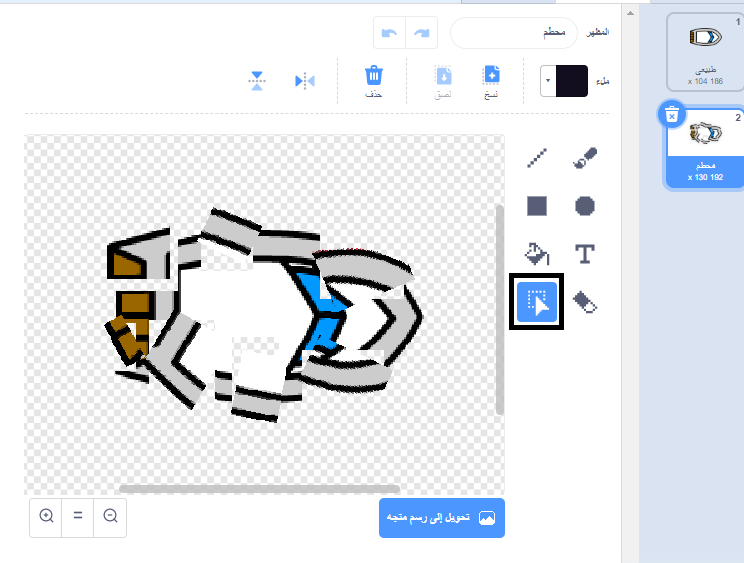

## الاصطدام!

في هذه اللحظة، يمكن للكائن الممثل للقارب أن يبحر عبر الحواجز الخشبية! يجب أن تقوم بحل تلك المشكلة فوراً.

--- task ---

تحتاج إلى اثنين من مظاهر كائن القارب: واحد من مظهر عادي، والآخر من عندما يتحطم القارب. قم بتكرار مظهر كائن القارب، واسم المظهر "طبيعي" والآخر "متحطم".

--- /task ---

--- task ---

انقر على مظهر 'المتحطم`، و استخدم أداة  اختيار  لأخذ قطع من المظهر و تحريك و تدوير القارب لجعل القارب يبدو وكأنه تحطم على أجزاء.



--- /task ---

--- task ---

الآن قم بإضافة برنامج إلى قاربك بحيث يصطدم و يتحطم إلى أجزاء عندما يلامس أي حاجز خشبي بني.

--- hints ---
 --- hint ---

تحتاج إلى إضافة كتل التعليمات البرمجية داخل حلقة `للأبد`{:class="block3control"} بحيث يستمر الكود الخاص بك في التحقق مما إذا كان كائن القارب قد تحطم، وإذا تحطم تقوم التعليمة البرمجية إلى إعادة تعيين موقع كائن القارب.

`إذا`{:class="block3control"} القارب `لمس`{:class="block3sensing"} اللون البني للخشب، تحتاج إلى `التبديل إلى المظهر المتحطم`{:class="block3looks"}، `قل كلالالالا! لمدة 2 ثانية`{:class="block3looks"}، وثم `عد إلى المظهر الطبيعي`{:class="block3looks"}. أخيراً، ستحتاج إلى`النقطة لأعلى`{:class="block3motion"} و `اذهب إلى نقطة البدء`{:class="block3motion"}.

--- /hint --- --- hint ---

هنا التعليمات البرمجية التي ستحتاج اليها:


```blocks3
if <touching color [ ] ?> then
end

go to x: (-190) y: (-150)

switch costume to (متحطم v)

point in direction (0)

switch costume to (طبيعي v)

say [لاااااااا!] for (2) seconds
```

--- /hint --- --- hint ---

و هذا ما يجب أن تبدو عليه التعليمات البرمجية الخاصة بك:


```blocks3
when flag clicked
point in direction (0)
go to x: (-190) y: (-150)
forever
if <(distance to (mouse-pointer v)) > [5]> then
point towards (mouse-pointer v)
move (1) steps
end
if <touching color [#663b00] ?> then
switch costume to (متحطم v)
say [لاااااااا!] for (2) seconds
switch costume to (طبيعي v)
point in direction (0)
go to x: (-190) y: (-150)
end
```

--- /hint ------ /hints ---

--- /task ---

--- task ---

يجب أيضاً أن تضيف بعض التعليمات البرمجية للتأكد فيما إذا كان قاربك يبدأ في الظهور "بشكل طبيعي".

اختبر التعليمة البرمجية الخاص بك مرة أخرى. إذا حاولت الإبحار بالقارب عبر حاجز خشبي الآن، فيجب أن يتحطم القارب ثم يعود إلى نقطة بدايته (انطلاقه).


--- /task ---