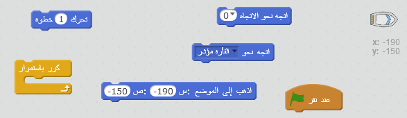
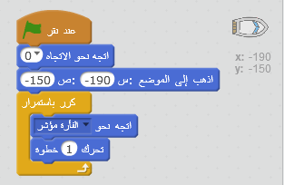
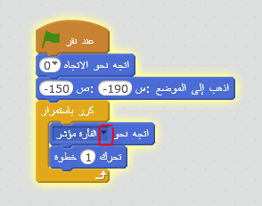
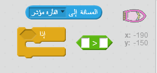
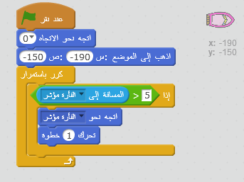

## التحكم في القارب

\--- task \---

ستقوم بالسيطرة على القارب بـ الفأره. أضف تعليمة برمجية إلى قاربك بحيث يبدأ في الزاوية السفلية اليسرى متجهًا إلى أعلى ثم يتبع مؤشر الفأره. **اختبر التعليمة البرمجية** لتتأكد من أنها تنفذ الأمر المطلوب.

\--- hints \--- \--- hint \--- بمجرد`النقر فوق العلم الأخضر`، ستحتاج إلى جعل القارب `يذهب إلى موقع البداية` و `توجَّه إلى أعلى`. بعد ذلك ، ستحتاج إلى `الإشارة إلى مؤشر الفارة` و `تحركه خطوة واحدة`. سوف تحتاج إلى تكرار هذا `للأبد`.

\--- /hint \--- \--- hint \--- فيما يلي التعليمات البرمجية التي ستحتاج إلى استخدامها:  \--- /hint \--- \--- hint \--- يجب أن تكون التعليمة البرمجية التي تُدخلها كما يلي:  \--- /hint \--- \--- /hints \---

\--- /task \---

\--- task \---

اختبر قاربك من خلال النقر على العلم وتحريك الفأره. هل يبحر القارب نحو الفأره؟

## \--- collapse \---

title: إذا كنت تواجه مشاكل...

## image: images / image.png

**ملاحظة:** يوجد حاليًا خطأ في Scratch مما يعني أن القارب قد لا يتحرك باتجاه مؤشر الفأرة. إذا حدث ذلك ، فانقر فوق السهم الموجود على لبنة `توجَّه نحو` وأعد تحديد `مؤشر الفأرة`.

 \--- /collapse \---

\---/task\---

\--- task \---

ماذا يحدث عندما يصل القارب إلى مؤشر الفأره؟ جربها.

\--- /task \---

\--- task \---

لتجنب حدوث ذلك، ستحتاج إلى إضافة لبنة `إذا` برمجية إلى التعليمة البرمجية، بحيث لا يتحرك القارب إلا إذا كان على بُعد 5 بكسل من الفأره.

\--- hints \--- \--- hint \--- يجب ألا يتجه القارب إلى مؤشر الفأره ويتحرك إلا `إذا` كانت قيمة `البُعد عن مؤشر الفأره` هي `أكبر من 5 بكسل`. \--- /hint \--- \--- hint \--- فيما يلي التعليمات البرمجية التي ستحتاج إلى استخدامها:  \--- /hint \--- \--- hint \--- يجب أن تكون التعليمة البرمجية التي تُدخلها كما يلي:  \--- /hint \--- \--- /hints \---

\--- /task \---

\--- task \---

اختبر قاربك مرة أخرى لتتحقق مما إذا كانت المشكلة قد حُلت أم لا.

\--- /task \---