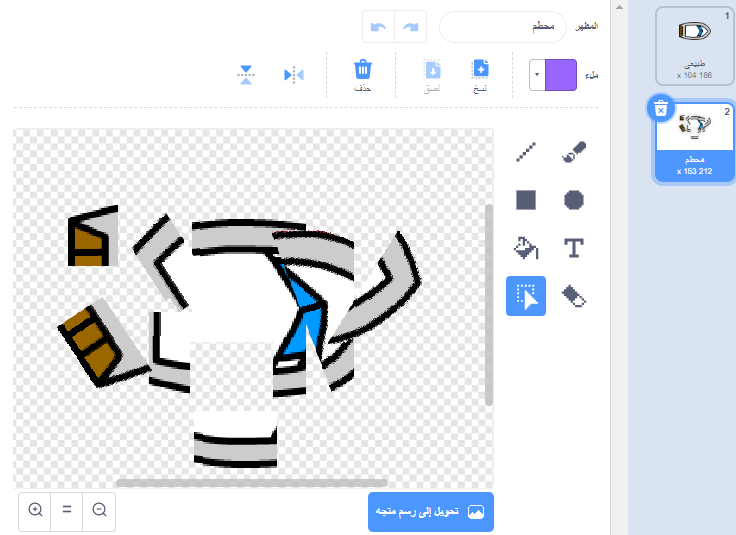
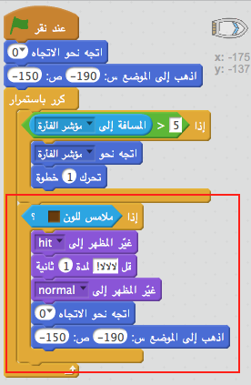
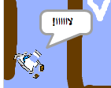

## الاصطدام!

في هذه اللحظة ، يمكن أن يبحر قاربك في الحواجز الخشبية! دعونا نصلح ذلك.

\--- task \---

ستحتاج إلى مظهرَين لقاربك، أحدهما المظهر العادي، والآخر مظهر القارب عندما يصطدم. كرِّر مظهر القارب، وسمِّ المظهر الأول 'عادي' والآخر 'اصطدام'.

\--- /task \---

\--- task \---

انقر على المظهر 'اصطدام'، ثم اختر أداة التحديد لجمع أجزاء القارب وتحريكها وتوزيعها في كل مكان ليبدو القارب محطمًا.

\--- /task \---

\--- task \---

أضف الآن تعليمة برمجية إلى قاربك بحيث يصطدم ويتحطم عندما يلمس أي قطعة خشبية بنية اللون.

\--- hints \--- \--- hint \--- تحتاج إلى إضافة تعليمة برمجية داخل حلقة `كرِّر باستمرار` لكي تستمر التعليمة البرمجية في التحقق مما إذا كان القارب قد اصطدم. `إذا` كان القارب ي`لامس` اللون البني للخشب، فإنك تحتاج إلى إدخال `تحوَّل إلى المظهر اصطدام`، و `قل لااااا! لمدة 2 ثانية`، ثم `عُد إلى المظهر عادي`. وأخيرًا، ستحتاج إلى `توجَّه إلى أعلى` و `انتقل إلى موقع البدء`. \--- /hint \--- \--- hint \--- فيما يلي التعليمات البرمجية التي ستحتاج إليها:  \--- /hint \--- \--- hint \--- هكذا يجب أن تكون التعليمة البرمجية التي تُدخلها:  \--- /hint \--- \--- /hints \---

\--- /task \---

\--- task \---

يجب أن تتأكد أيضًا من أن قاربك يبدأ دائمًا بالمظهر 'عادي'.

إذا حاولت الإبحار عبر حاجز خشبي الآن ، يجب أن ترى قاربك يصطدم ويتحطم ثم يعود إلى موقع البدء.

\--- /task \---