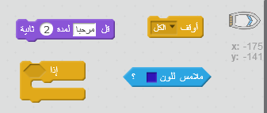
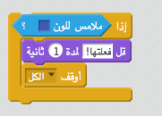

## التحدي: الفوز!

هل يمكنك إضافة عبارة `إذا` أخرى إلى التعليمات البرمجية لقاربك، بحيث يفوز اللاعب عندما يصل إلى الجزيرة المعزولة؟

عندما يصل القارب إلى الجزيرة الصحراوية الصفراء المعزولة، يجب أن تقول اللعبة "فعلتُها!" ومن ثم يجب أن تتوقف اللعبة.

\--- hints \--- \--- hint \--- حتاج إلى إضافة المزيد من التعليمات البرمجية داخل حلقة `كرِّر باستمرار` لكي تستمر تعليماتك البرمجية في التحقق مما إذا كان اللاعب قد فاز. `إذا` كان القارب `يلامس` لون الجزيرة المعزولة، تحتاج إلى `قل 'فعلتُها!' لمدة 2 ثانية` ثم `أوقف الكل` لإنهاء اللعبة. \--- /hint \--- \--- hint \--- فيما يلي التعليمات البرمجية التي ستحتاج إليها:  \--- /hint \--- \--- hint \--- هكذا يجب أن تكون التعليمة البرمجية التي تُدخلها: 

تذكَّر أن التعليمة البرمجية الجديدة يجب أن تكون داخل حلقة `كرِّر باستمرار`. \--- /hint \--- \--- /hints \---