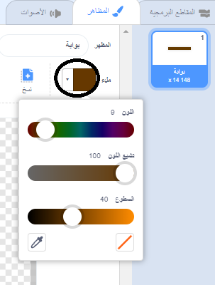

## سباق الزمن

الآن اللعبة **far** سهلة جداً، لذلك ستضيف بعض الأشياء لجعلها أكثر إثارة للاهتمام.

أولاً ، ستضيف بعض التعزيزات لتسريع القارب.

--- task ---

تعديل خلفية المنصة عن طريق إضافة بعض الأسهم المعززة البيضاء.


--- /task ---

--- task ---

الآن أضف المزيد من كتل التعليمات البرمجية لحلقة القارب `للأبد`{:class="block3control"} بحيث يتحرك كائن القارب ثلاث خطوات إضافية عندما يلمس سهم أبيض.


```blocks3
if <touching color [#FFFFFF] ?> then
move (3) steps
end
```

--- /task ---

--- task ---

قم باختبار لعبتك للتأكد فيما إذا كانت الأسهم المعززة تزيد من سرعة القارب.

--- /task ---

تالياً يجب عليك إضافة بوابة دوارة يجب على قاربك أن يتجنبها.

--- task ---

قم بإضافة كائن جديد بحيث يبدو بهذا الشكل ، وأطلق عليه 'بوابة':


قم بالتأكد من أن البوابة لها نفس لون الحواجز الخشبية.



--- /task ---

--- task ---

قم بالتأكد من أن مركز البوابة يقع في الوسط.


--- /task ---

--- task ---

قم بإضافة تعليمة برمجية إلى بوابتك بحيث تدور ببطء بشكل دائم.

--- hints ---
 --- hint ---

قم بإضافة تعليمات برمجية إلى البوابة بحيث `تدور درجة واحدة`{:class="block3motion"} `بشكل دائم`{:class="block3control"}.

--- /hint --- --- hint ---

هنا التعليمات البرمجية التي تحتاج إليها:


```blocks3
forever
end

turn cw (1) degrees

when flag clicked
```

--- /hint --- --- hint ---

إليك الشكل الذي يجب أن تبدو عليه التعليمات البرمجية الجديدة:


```blocks3
when flag clicked
forever
turn cw (1) degrees
end
```

--- /hint ------ /hints ---

--- /task ---

--- task ---

اختبر لعبتك مرة أخرى. يجب أن يكون لديك الآن بوابة دوران تحتاج إلى تحريك قاربك حولها.


--- /task ---