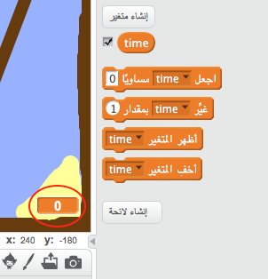
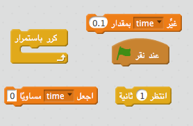
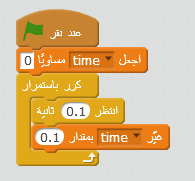
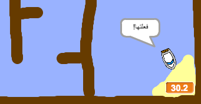

## سباق الزمن

لنُضف موقِّتًا إلى لعبتك، بحيث يتسابق اللاعب للوصول إلى الجزيرة المعزولة في أسرع وقت ممكن.

\--- task \---

أضف متغيرًا جديدًا يُسمى `الوقت` إلى المنصة. يمكنك أيضًا تغيير طريقة عرض المتغير الجديد الذي تضيفه.

[[[generic-scratch-add-variable]]]

\--- /task \---

\--- task \---

الآن أضف تعليمة برمجية إلى المنصة لكي يبدأ الموقِّت في العدّ حتى يصل القارب إلى الجزيرة المعزولة.

\--- hints \--- \--- hint \--- على المنصة، `عند النقر على العلم الأخضر`، `ضبط الوقت إلى 0`. داخل قالب `كرِّر باستمرار`، ستحتاج أولاً إلى إدخال `انتظر 0.1 ثانية`، ثم `غيِّر الزمن بمقدار 0.1`. \--- /hint \--- \--- hint \--- فيما يلي التعليمات البرمجية التي ستحتاج إليها:  \--- /hint \--- \--- hint \--- هكذا يجب أن تكون التعليمة البرمجية التي تُدخلها:  \--- /hint \--- \--- /hints \---

\---/task\---

\--- task \---

أحسنت! اختبر لعبتك لتعرف السرعة التي يمكنك أن تصل بها إلى الجزيرة المعزولة!

\---/task\---