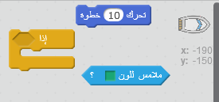
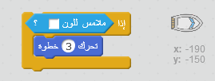
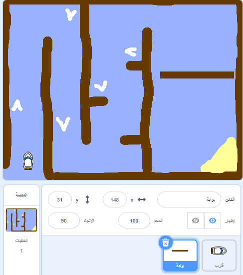
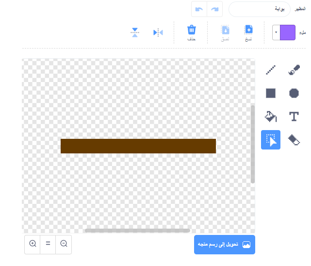
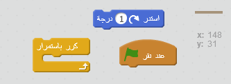
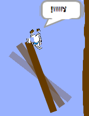

## العوائق وعمليات التشغيل

أصبحت هذه اللعبة سهلة إلى *حد كبير* الآن - دعنا نضيف بعض الأشياءَ التي تضفي عليها المزيد من التشويق.

\--- task \---

لنضِف أولًا بعض 'المسرعات' إلى لعبتك لزيادة سرعة القارب. قم بتحرير خلفية المنصة وأضف بعض أسهم التسريع البيضاء.

\--- /task \---

\--- task \---

أضف الآن بعض التعليمات البرمجية إلى حلقة التكرار المتواصل بالقارب ليتحرك ثلاث خطوات إضافية عندما يلامس سهم التسريع الأبيض.

\--- /hint \--- \--- hint \--- `إذا` كان قاربك `يلامس سهم التسريع الأبيض`، فيجب أن `يتحرك 3 خطوات إضافية`.  
\--- /hint \--- \--- hint \--- فيما يلي التعليمات البرمجية التي ستحتاج إلى استخدامها:  \--- /hint \--- \--- hint \--- يجب أن تكون التعليمة البرمجية التي تُدخلها كما يلي:  \--- /hint \--- \--- /hints \---

\--- /task \---

\--- task \---

يمكنك أيضًا إضافة بوابة دوَّارة ليتفاداها قاربك. أضف نقشًا جديدًا يُسمى 'بوابة' بحيث يبدو كما يلي:

تأكد من أن لون البوابة هو نفس لون الحواجز الخشبية.

\--- /task \---

\--- task \---

تعيين مركز بوابة الكائن.

\--- /task \---

\--- task \---

أضف تعليمة برمجية إلى بوابتك بحيث تدور ببطء دائمًا.

\--- hints \--- \--- hint \--- أضف تعليمة برمجية إلى كائن البوابة بحيث تكون `لف درجة واحدة` `كرِّر باستمرار`. \--- /hint \--- \--- hint \--- فيما يلي التعليمات البرمجية التي ستحتاج إليها:  \--- /hint \--- \--- hint \--- هكذا يجب أن تكون التعليمة البرمجية التي تُدخلها:  \--- /hint \--- \--- /hints \---

\--- /task \---

\--- task \---

اختبر لعبتك. ستكون لديك الآن بوابة دوَّارة يجب أن تتفاداها.

\--- /task \---