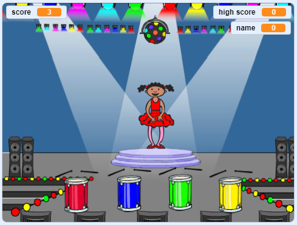

## এরপর কি?

'নৌকা বাইচ' প্রকল্পটি সম্পন্ন করার জন্য অভিনন্দন! আপনি কি আরও কিছু চ্যালেঞ্জিং তৈরি করতে চান?

চ্যাটবোট প্রকল্পটি চেষ্টা করে দেখুন[Memory](https://projects.raspberrypi.org/en/projects/memory?utm_source=pathway&utm_medium=whatnext&utm_campaign=projects) ।.

\--- no-print \---

শুরু করতে সবুজ পতাকাটিতে ক্লিক করুন।. নর্তকীর পোশাকে দেখানো রঙের ক্রম দেখুন এবং তার সাথে ড্রাম বিটগুলি শুনুন, তারপরে রঙগুলি তার কাছে আবার রিপিট করুন।. আপনি যদি রঙগুলির ক্রমটি ভুল করেন তবে খেলা শেষ!

  <iframe allowtransparency="true" width="485" height="402" src="//scratch.mit.edu/projects/embed/284452634/?autostart=false" frameborder="0" allowfullscreen scrolling="no"></iframe> 

\--- /no-print \---

\--- print-only \---

\--- /print-only \---