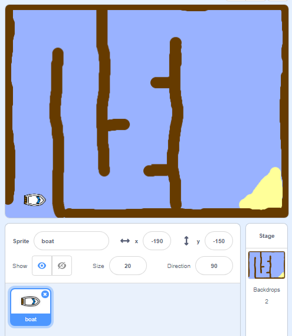

## শুরু করুন

\--- task \---

Starter Project টি খুলুন।.

**অনলাইন:** starter project টি পেতে এখানে ক্লিক করুন [rpf.io/boat-race-starter-on](http://rpf.io/boat-race-starter-on){:target="_blank"}.

আপনার যদি Scratch একাউন্ট থাকে তাহলে এখানে ক্লিক করে একটি কপি পেতে পারেন **Remix**.

**অফলাইন:** প্রজেক্ট টি ডাউনলোড করার জন্য এই লিংক এ ক্লিক করুন [rpf.io/p/en/boat-race-go](http://rpf.io/p/en/boat-race-go){:target="_blank"}, এবং offline editor ব্যবহার করে সেটি খুলুন.

আপনার যদি Scratch offline editor ডাউনলোড এবং ইনস্টল করতে হয় তবে আপনি এটি [rpf.io/scratchoff](http://rpf.io/scratchoff){:target="_blank"} তে খুঁজে পেতে পারেন।.

\--- /task \---

\--- task \---

প্রকল্পটিতে একটি বোট Sprite এবং একটি রেস কোর্স ব্যাকড্রপ সহ এতে অন্তর্ভুক্ত রয়েছে:

- কাঠ যা কিনা বোট sprite এর জন্য প্রতিবন্ধক এবং একে এড়িয়ে যেতে হবে
- লক্ষ্য হিসেবে একটি মরুভূমির দ্বীপ যেখানে নৌকাকে পৌঁছতে হবে খেলায় বিজয়ী হবার জন্য
    
    

\--- /task \---