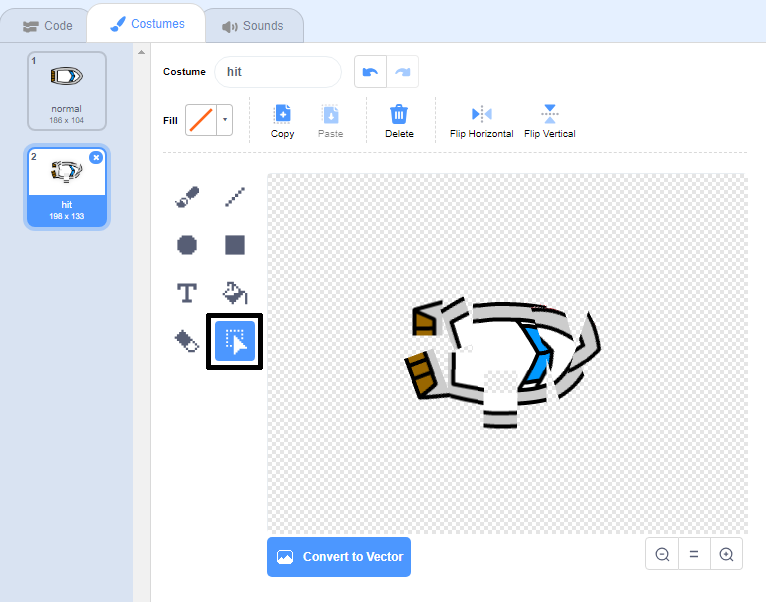

## বিপর্যয়!

এখনো পর্যন্ত বোট sprite কেবলমাত্র কাঠের বাধা কাটিয়ে এগোতে পারে, এটাকে এবার আরো ভালো করতে হবে.

--- task ---

নৌকার জন্য দুইটি costume প্রয়োজন, একটি স্বাভাবিক নৌকার এবং আরেকটি বিধ্বস্ত নৌকার জন্য। নৌকার costume কে ডুপ্লিকেট করে একটিকে 'normal' এবং আরেকটিকে 'hit' নাম দিন।.

--- /task ---

--- task ---

আপনার 'hit' costume টিতে ক্লিক করুন, এবং costume র টুকরো টুকরো টুকরো করার জন্য **select** সরঞ্জামটি ব্যবহার করুন এবং টুকরোগুলোকে এমন ভাবে ঘোরান যাতে মনে হয় বোটটি বিপর্যস্ত এবং টুকরো টুকরো হয়ে যায়.



--- /task ---

--- task ---

এখন এমনভাবে কোড করতে হবে যেন নৌকা কাঠ স্পর্শ করলেই বিধ্বস্ত হয়।.

--- hints ---
 --- hint ---

আপনাকে আপনার কোড ব্লক যুক্ত করতে হবে `forever`{:class="block3control"} লুপ এর মধ্যে যাতে আপনার কোডটি বোট sprite ক্র্যাশ হয়েছে কিনা তা নজরে রাখে এবং যদি এটি ক্র্যাশ হয়ে যায় তবে কোডটিকে বোট sprite এর অবস্থান পুনরায় সেট করতে হবে।.

`if`{:class="block3control"} যদি বোট `touching`{:class="block3sensing"} করে, যদি বাদামি রঙের কাঠ হয় তাহলে আপনাকে `switch to the hit costume`{:class="block3looks"} পরিবর্তন করতে হবে, তারপর `say Noooo! 2 সেকেন্ড `{:class="block3looks"}, এবং তারপরে ` আবার সাধারণ costume `{:class="block3looks"} এ ফিরে যান. আপনাকে যেটা করতে হবে সেটা হলো `point up`{:class="block3motion"} এবং `go to the start position`{:class="block3motion"}.

--- /hint --- --- hint ---

আপনার প্রয়োজনীয় কোড ব্লক গুলি হলো:


```blocks3
if <touching color [ ] ?> then
end

go to x: (-190) y: (-150)

switch costume to (hit v)

point in direction (0)

switch costume to (normal v)

say [Noooooo!] for (2) seconds
```

--- /hint --- --- hint ---

এখানে আপনার কোডটি এইরকম দেখতে হওয়া উচিত:


```blocks3
when flag clicked
point in direction (0)
go to x: (-190) y: (-150)
forever
if <(distance to (mouse-pointer v)) > [5]> then
point towards (mouse-pointer v)
move (1) steps
end
if <touching color [#663b00] ?> then
switch costume to (hit v)
say [Noooooo!] for (2) seconds
switch costume to (normal v)
point in direction (0)
go to x: (-190) y: (-150)
end
```

--- /hint --- --- /hints ---

--- /task ---

--- task ---

আপনাকে কোড যোগ করতে হবে যাতে খেলা শুরুর সময় নৌকা "normal costume" বা স্বাভাবিক অবস্থায় থাকে.

আপনার কোডটি আবার পরীক্ষা করুন। এখনআপনি যদি কাঠের বাধা পেরিয়ে বোট চালানোর চেষ্টা করেন, তবে নৌকোটি ক্র্যাশ হয়ে যাবে এবং তারপরে তার প্রথম অবস্থানে ফিরে যাবে।.


--- /task ---