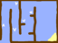
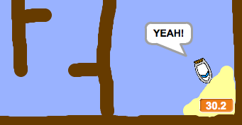

## Timer যোগ করা

খেলায় একটি টাইমার যোগ করুন, এতে খেলোয়াড়কে যত দ্রুত সম্ভব দ্বীপে পৌঁছাতে হবে নির্দিষ্ট সময়ের মধ্যে.

--- task ---

এইবার আপনার প্রকল্পে নামে একটি নতুন ভেরিয়েবল `time`{:class="block3variables"} যুক্ত করুন.


[[[generic-scratch3-add-variable]]]

আপনার নতুন ভেরিয়েবলটি কীভাবে ডিসপ্লে হয় তা পরিবর্তন করে আপনি আপনার টাইমারটির জন্য একটি চেহারাও ঠিক করে নিতে পারেন.

--- /task ---

--- task ---

স্টেজে নতুন কোড ব্লক যোগ করুন যেন টাইমার নৌকার দ্বীপে পৌঁছতে কতক্ষণ সময় লাগে তার হিসাব পাওয়া যায়.

--- hints ---
 --- hint ---

স্টেজ এর উপরে যখন, `when the green flag is clicked`{:class="block3control"}, `set the time to 0`{:class="block3variables"}. `forever`{:class="block3control"} লুপ এর মধ্যে আপনি `wait 0.1 secs`{:class="block3control"}, then `change the time by 0.1`{:class="block3variables"} কোডগুলি যোগ করুন.

--- /hint --- --- hint ---

আপনার প্রয়োজনীয় কোড ব্লকগুলি হলো:



```blocks3
change [time v] by (0.1)

when flag clicked

forever
end

wait (0.1) seconds

set [time v] to [0]
```

--- /hint --- --- hint ---

আপনার নতুন কোডটি দেখতে এইরকম হওয়া উচিত:


```blocks3
when flag clicked
set [time v] to [0]
forever
wait (0.1) seconds
change [time v] by (0.1)
end
```

--- /hint --- --- /hints ---

--- /task ---

--- task ---

সমাপ্ত! এখন কোড ঠিক আছে কিনা তা পরীক্ষা করুন এবং কত তাড়াতাড়ি দ্বীপ এ পৌঁছতে পারেন দেখুন!



--- /task ---