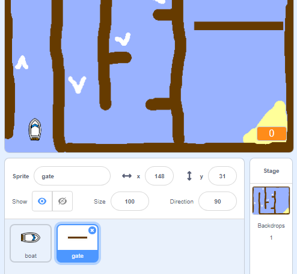
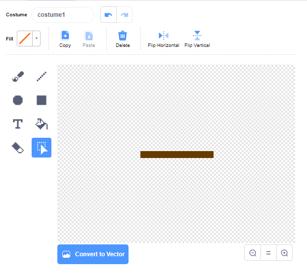

## প্রতিকূলতা ও বুস্টার

** ** এই মুহূর্তে এই খেলাটি খুব সহজ - চলুন একে আরো আকর্ষণীয় করার জন্য আরোও কিছু যোগ করা যাক।.

প্রথমে, আপনি নৌকার গতি বাড়ানোর জন্য কিছু বুস্টার যুক্ত করবেন।.

\--- task \---

কিছু সাদা বুস্টার তীর যুক্ত করে আপনার স্টেজ ব্যাকড্রপ এডিট করুন।.


\--- /task \---

\--- task \---

এখন বোট কোড এর লুপ এ আরো কোড ব্লক যোগ করুন `forever`{:class="block3control"} যাতে বোট sprite তিন অতিরিক্ত পদক্ষেপ নিতে পারে যখন এটি একটি সাদা তীর স্পর্শ করে।.


```blocks3
if <touching color [#FFFFFF] ?> then
move (3) steps
end
```

\--- /task \---

\--- task \---

আপনার নতুন বুস্টার তীরগুলি নৌকার গতি বাড়ায় কিনা তা দেখতে আপনার গেমটি পরীক্ষা করুন।.

\--- /task \---

এর পরে আপনি একটি স্পিনিং গেট যুক্ত করবেন যা বোট টি কে এড়িয়ে চলতে হবে.

\--- task \---

এইরকম দেখতে নতুন একটি sprite যুক্ত করুন এবং এটিকে 'গেট' বলুন:



গেট sprite এবং কাঠের বাধা গুলির রঙ একই হতে হবে।.


\--- /task \---

\--- task \---

গেট স্প্রাইটের কেন্দ্রটি মাঝখানে অবস্থিত রয়েছে তা নিশ্চিত করুন।.



\--- /task \---

\--- task \---

গেট sprite এর জন্য একটি কোড যোগ করুন যেন গেটটি অনবরত আস্তে আস্তে ঘুরতে থাকে।.

\--- hints \--- \--- hint \---

গেট sprite এ কোড ব্লক যোগ করুন যাতে এটি `turns 1 degree`{:class="block3motion"} `forever`{:class="block3control"}.

\--- /hint \--- \--- hint \---

আপনার প্রয়োজনীয় কোড ব্লক গুলি হলো:


```blocks3
forever
end

turn cw (1) degrees

when flag clicked
```

\--- /hint \--- \--- hint \---

আপনার নতুন কোডটি দেখতে এমন হওয়া উচিত:


```blocks3
when flag clicked
forever
turn cw (1) degrees
end
```

\--- /hint \--- \--- /hints \---

\--- /task \---

\--- task \---

আপনার গেমটি আবার পরীক্ষা করুন। আপনার এখন একটি স্পিনিং গেট থাকা উচিত যা আপনার নৌকাকে চারপাশে ঘোরাবে.


\--- /task \---