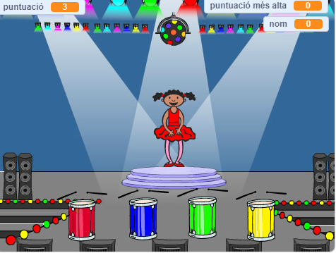

## I ara què ve?

Enhorabona per haver completat el projecte 'Carrera de vaixells'. T'agradaria provar alguna cosa més desafiant?

Pots provar el projecte [Memòria](https://projects.raspberrypi.org/en/projects/memory?utm_source=pathway&utm_medium=whatnext&utm_campaign=projects).

\--- no-print \--- Fes clic a la bandera verda per començar. Mira la seqüència de colors que mostra el vestit del ballarí i escolta els cops de tambor que l'acompanyen i, a continuació, repeteix la seqüència dels colors. Si tries els colors en un ordre equivocat, ¡hauràs perdut!

  <iframe allowtransparency="true" width="485" height="402" src="//scratch.mit.edu/projects/embed/284452634/?autostart=false" frameborder="0" allowfullscreen scrolling="no" mark="crwd-mark"></iframe> 

\--- / no-print \---

\--- print-only \---  \--- /print-only \---