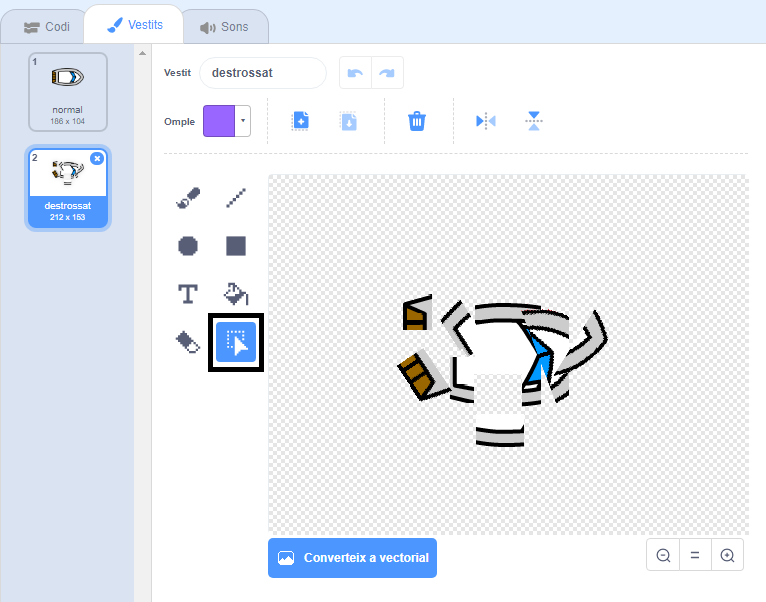

## Crashing!

At the moment, the boat sprite can simply sail through the wooden barriers! You're going to fix that now.

\--- task \---

You need two costumes for your boat sprite: one normal costume, and one for when the boat crashes. Duplicate your boat sprite's costume, and name one costume 'normal' and the other 'hit'.

\--- /task \---

\--- task \---

Click on your 'hit' costume, and use the **Select** tool to grab pieces of the costume and move and rotate them to make the boat look like it has crashed to pieces.



\--- /task \---

\--- task \---

Now add code to your boat so that it crashes and breaks up when it touches any brown wooden barriers.

\--- hints \--- \--- hint \--- You need to add code blocks inside your `forever`{:class="block3control"} loop so that your code keeps checking if the boat sprite has crashed, and if it has crashed, the code needs to reset the boat sprite's position.

`if`{:class="block3control"} the boat is `touching`{:class="block3sensing"} the brown colour of the wood, you need to `switch to the hit costume`{:class="block3looks"}, `say Noooo! for 2 seconds`{:class="block3looks"}, and then `switch back to the normal costume`{:class="block3looks"}. Finally, you'll need to `point up`{:class="block3motion"} and `go to the start position`{:class="block3motion"}.

\--- /hint \--- \--- hint \--- Here are the code blocks you need: 

```blocks3
if <touching color [ ] ?> then
end

go to x: (-190) y: (-150)

switch costume to (hit v)

point in direction (0)

switch costume to (normal v)

say [Noooooo!] for (2) seconds
```

\--- /hint \--- \--- hint \--- Here's what your code should look like: 

```blocks3
when flag clicked
point in direction (0)
go to x: (-190) y: (-150)
forever
if <(distance to (mouse-pointer v)) > [5]> then
point towards (mouse-pointer v)
move (1) steps
end
if <touching color [#663b00] ?> then
switch costume to (hit v)
say [Noooooo!] for (2) seconds
switch costume to (normal v)
point in direction (0)
go to x: (-190) y: (-150)
end
```

\--- /hint \--- \--- /hints \---

\--- / tasca \---

\--- tasca \---

You should also add code to make sure that your boat sprite always starts out looking 'normal'.

Test your code again. If you try to sail the boat through a wooden barrier now, the boat should crash and then move back to its starting position.


\--- /task \---