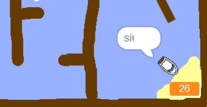

## Afegir un temporitzador

Ara afegiràs un cronòmetre al teu joc, de manera que el jugador ha d'arribar a l'illa el més ràpidament possible.

\--- task \---

Afegeix una nova variable al teu escenari i anomenala `temps`{:class = "blockvariable"}.


[[[generic-scratch3-add-variable]]]

També pots triar un aspecte del teu temporitzador canviant la manera de mostrar la vostra nova variable.

\--- /task \---

\--- task \---

Ara afegeix el codi al teu escenari perquè el temporitzador estigui comptant fins que el vaixell arribi a l'illa deserta.

\--- hints \--- \--- hint \--- A l'escenari `quan es fa clic a la bandera verda`{:class="block3control"}, ` reiniciar el temps a 0`"}{:class="block3variables"}. Dins del teu bucle ` infinitament ` {: class = "block3control"}, primer hauràs de ` esperar 0.1 segons ` {: class = "block3control"}, llavors ` canviar el temps a 0,1 ` {: class = "block3variables"}. \--- /hint \--- \--- hint \--- Hi ha dos conjunts de blocs de codi que pots utilitzar: 

```blocks3
canviar [temps v] per (0.1)

quan es fa clic a la bandera

infinitament
fi

espera (0,1) segons

reiniciar [temps v] a [0]
```

\--- /hint \--- \--- hint \--- Això és el que hauria de tenir el teu codi: 

```blocks3
quan es fa clic a la bandera
posar [temps v] a [0]
infinitament
esperar (0,1) segons
canviar [temps v] per (0.1)
fi
```

\--- /hint \--- \--- /hints \---

\--- /task \---

\--- task \---

Prova el joc i vejam com de ràpid aconsegueixes arribar a l'illa!



\--- /task \---