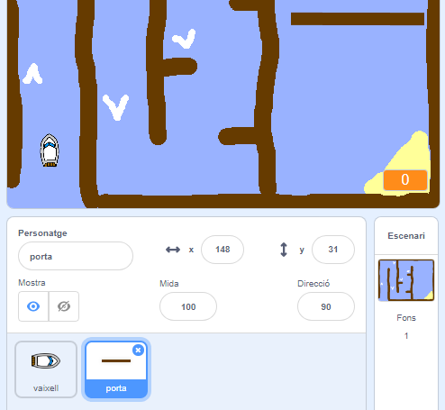
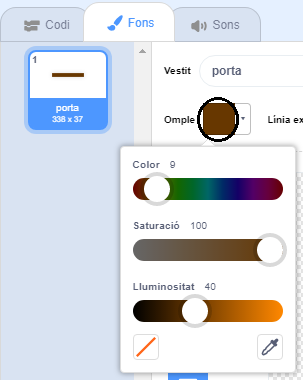
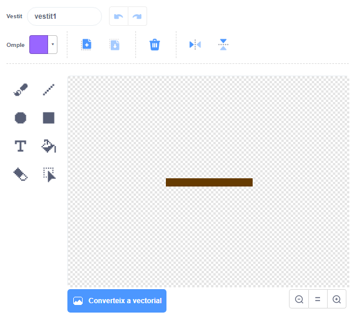

## Obstacles i potenciadors

Ara mateix aquest joc és **massa** fàcil - per això afegirem algunes coses perquè sigui més interessant.

Primer, afegiràs alguns potenciadors per accelerar el vaixell.

--- task ---

Edita el fons del teu escenari afegint algunes fletxes potenciadores de color blanc.


--- /task ---

--- task ---

Ara afegeix més blocs de codi al bucle `per sempre`{:class="block3control"} del teu vaixell de manera que avanci tres passos addicionals quan toca una fletxa blanca.


```blocks3
if <touching color [#FFFFFF] ?> then
move (3) steps
end
```

--- /task ---

--- task ---

Prova el teu joc per veure si les noves fletxes potenciadores acceleren el vaixell.

--- /task ---

A continuació, afegiràs una porta giratòria que el vaixell ha d’evitar.

--- task ---

Afegeix una icona nova que s’assembli a una porta giratòria i l'anomenes "porta":



Assegura't que el color de la porta sigui el mateix que el de les barreres de fusta.



--- /task ---

--- task ---

Assegura't que el centre de la icona de la porta estigui situat al mig.



--- /task ---

--- task ---

Afegeix codi a la teva porta perquè giri lentament de manera infinita.

--- hints --- --- hint ---

Afegeix blocs de codi a la icona de la porta de manera que `gira 1 grau`{:class="block3motion"} `per sempre`{:class="block3control"}.

--- /hint --- --- hint ---

Aquí tens els blocs que necessites:


```blocks3
forever
end

turn cw (1) degrees

when flag clicked
```

--- /hint --- --- hint ---

Així és com s'hauria de veure el teu codi:


```blocks3
when flag clicked
forever
turn cw (1) degrees
end
```

--- /hint --- --- /hints ---

--- /task ---

--- task ---

Prova el teu joc de nou. Ara hauries de tenir una porta giratòria que necessites per remoure el vaixell.


--- /task ---