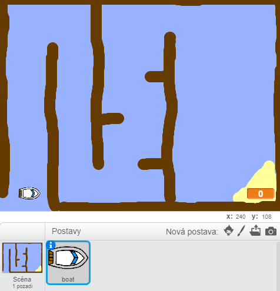

## Začínáme

\--- task \---

Otevři úvodní projekt.

## \--- collapse \---

title: Používám Scratch online

## image: images/image.png

Spusť úvodní Scratch projekt 'Závody lodí' na [jumpto.cc/boat-go](https://scratch.mit.edu/projects/63958014/#editor){:target="_blank"}. \--- /collapse \---

## \--- collapse \---

title: Používám Scratch offline

## image: images/image.png

Stáhni si úvodní Scratch projekt "Závody lodí" z [jumpto.cc/boat-get](http:jumpto.cc/boat-get){:target="_blank"} a otevři jej pomocí offline editoru. \--- /collapse \---

\--- /task \---

\--- task \---

Projekt obsahuje obrázek, který bude představovat loď a pozadí s výchozí situací, kde najdeš:

- Dřevo, kterému se loď musí vyhnout
- Opuštěný ostrov, na který se musí loď dostat
    
    

\--- /task \---