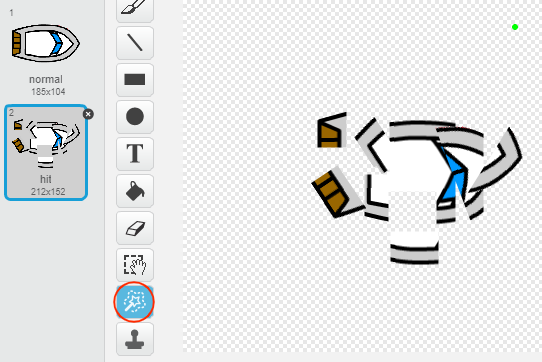
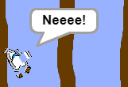

## Havárie!

V tuto chvíli může tvoje loď plout skrz dřevěné překážky! Pojďme to napravit.

\--- task \---

Budeš potřebovat dva “kostýmy” pro tvoji loďku, jeden normální, a jeden pro loďku po nárazu. Zduplikuj kostým tvojí loďky a nazvi je ‘normal’ (normální) a ‘hit’ (náraz).

\--- /task \---

\--- task \---

Klikni na kostým ‘hit’ a vyber nástroj ‘Select’ abys loďku rozdělil(a) na kousky a ty různě natoč. Uprav loďku tak, aby vypadala jako po nárazu.

\--- /task \---

\--- task \---

Přidej kód k své loďce tak, aby havarovala a rozbila se, jakmile se dotkne hnědého dřeva.

\--- hints \--- \--- hint \--- Kód musíš přidat do bloku `opakuj stále` abys zajistil(a), že kontrola kolize loďky s překážkami probíhá neustále. Blokem `Když` provádíme s loďkou test `dotýká se` barvy hnědá, která patří dřevu. Jakmile tato situace nastane, musíš `změnit kostým na hit (náraz)`, ukázat `bublinu Neee! na 2 vteřiny`. Pak zpět </code>změnit kostým na normální</1>. Konečně, budeš pro loďku muset `nastavit směr nahoru` a pak s ní `skočit na počáteční pozici`. \--- /hint \--- \--- hint \--- Zde jsou bloky, které budeš potřebovat:  \--- /hint \--- \--- hint \--- Takto by měl vypadat tvůj kód:  \--- /hint \--- \--- /hints \---

\--- /task \---

\--- task \---

Také by ses měl(a) ujistit, že tvoje loďka vždy začíná s nastaveným kostýmem "normální".

Pokud se teď pokusíš proplout dřevěnou bariérou, měl(a) bys vidět, jak se loďka rozpadne a vrátí se na start.

\--- /task \---