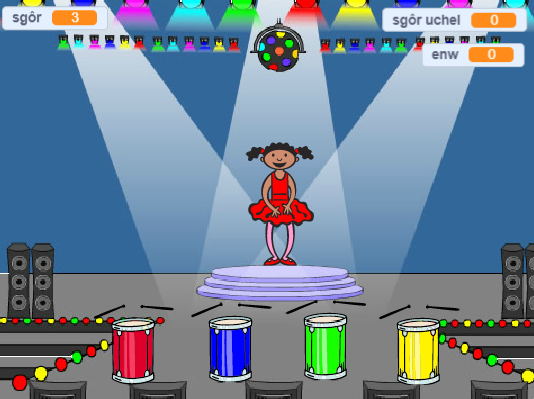

## Beth nesaf?

Llongyfarchiadau ar gwblhau'r prosiect 'Ras cwch'! Hoffet ti roi cynnig ar rhywbeth ychydig yn fwy heriol?

Rho gynnig ar y prosiect [Cofio](https://projects.raspberrypi.org/en/projects/memory?utm_source=pathway&utm_medium=whatnext&utm_campaign=projects).

\--- no-print \--- Clicia'r faner werdd i gychwyn. Gwylia'r dilyniant o liwiau sy'n cael eu arddangos ar wisg y dawnsiwr a gwrando ar guriadau'r drwm, yna ail-adrodda'r lliwiau yn ôl iddi. Os wyt ti'n cael trefn y lliwiau yn anghywir, yna mae'r gêm ar ben!

  <iframe allowtransparency="true" width="485" height="402" src="//scratch.mit.edu/projects/embed/284452634/?autostart=false" frameborder="0" allowfullscreen scrolling="no" mark="crwd-mark"></iframe> 

\--- /no-print \---

\--- print-only \---  \--- /print-only \---