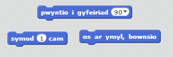
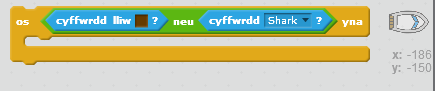

\--- challenge \---

## Her: mwy o rwystrau!

Elli di ychwanegu mwy o rwystrau at dy gêm? Dyma rai syniadau:

\--- task \---

Gelli di ychwanegu llysnafedd gwyrdd at dy gefndir a newid y gêm fel bod y llysnafedd yn arafu'r cwch pan mae'r cwch yn cyffwrdd ag e.

\--- hints \--- \--- hint \--- Gelli di ddefnyddio bloc `aros` i wneud hyn:  \--- /hint \--- \--- /hints \---

\--- /task \---

\--- task \---

Gelli di ychwanegu gwrthrych sy'n symud fel boncyff neu siarc!

\--- hints \--- \--- hint \--- Gall y blociau hyn dy helpu di i symud dy wrthrych newydd:

Os dyw dy wrthrych chi ddim yn frown, bydd angen i chi ychwanegu at god dy gwch:

 \--- /hint \--- \--- /hints \---

\--- /task \---

\--- /challenge \---