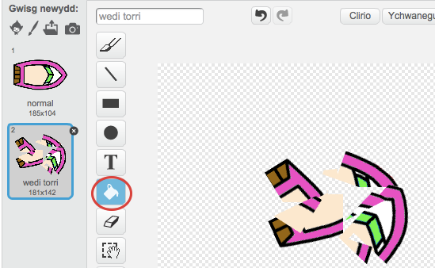

\--- her \---

## Her: mwy o gychod!

Alli di droi dy gêm yn ras rhwng 2 chwareuwr? Bydd angen i'r ail chwareuwr allu rheoli eu cwch yn defnyddio'r arwydd fyny i symud ymlaen, a dde a chwith i droi.

\--- hints \--- \--- hint \--- Copïa'r cwch a newidia liw cwch2.

 \--- hints \--- \--- hint \--- Gwna'r cwch i gychwyn mewn manau gwahanol gan newid y côd yma:

 \--- hints \--- \--- hint \--- Dileua gôd cwch2 sy'n defnyddio'r llygoden a'i ddisodoli gyda'r côd i reoli cwch 2 yn defnyddio'r bysellfwrdd. \--- hints \--- \--- hint \--- Dyma'r côd fydd ei angen i symud cwch2 ymlaen:

 \--- /hint \--- \--- hint \--- Bydd hefyd angen côd i *droi* y cwch pan mae'r bysellau saeth chwith a dde yn cael eu gwasgu. \--- /hint \--- \--- /hints \---

\--- /challenge \---