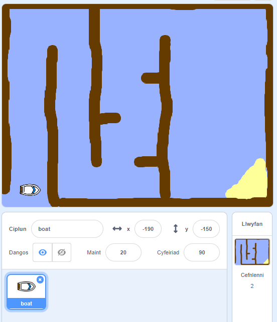

## Dechrau'r prosiect

\--- task \--- Agor y prosiect cychwynnol.

**Ar-lein:{:target="_blank"}** agor y prosiect cychwyn ar-lein yma [rpf.io/boat-race-starter-on ](http://rpf.io/boat-race-starter-on)\--- task \---, a chlicio ar **Ail-gymysgu**.

** All-lein: ** lawrlwytha'r prosiect cychwynnol o [ rpf.io/p/en/boat-race-get ](http://rpf.io/p/en/boat-race-get) {: target = "_ blank"} ac yna ei agor gan ddefnyddio'r golygydd all-lein.

Os oes angen i ti lawrlwytho a gosod golygydd Scratch all-lein, mae modd dod o hyd iddo yma [rpf.io/scratchoff](http://rpf.io/scratchoff).\--- /task \---

\--- task \---

Mae'r prosiect yn cynnwys corlun cwch a chefndir o'r cwrs gyda:

- Pren y mae'n rhaid i'th gwch di ei osgoi
- Ynys drofannol y mae'n rhaid i'th gwch di ei chyrraedd
    
    

\--- /task \---