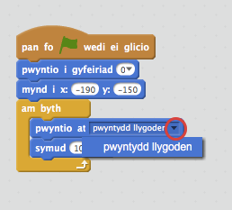
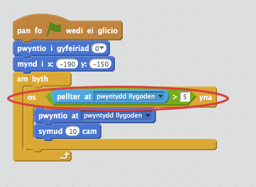

## Rheoli'r cwch

+ Rwyt ti'n mynd i reoli'r cwch gyda dy lygoden.  Ychwanega'r côd yma i dy gwch: 

	```blocks		
		pan fo ⚑ wedi ei glicio
		pwyntio i gyfeiriad (0 v)
		mynd i x:(-190) y:(-150)
		am byth
  		pwyntio tuag at [pwyntydd llygoden v]
   		symud (1) cam
		end
	```

+ Profa dy gwch, gan glicio ar y faner a symud y llygoden. Ydy dy gwch yn hwylio tuag at y llygoden?

	

	
	__Nodyn: Mae byg yn Scratch ar hyn o bryd sydd yn golygu ei fod yn bosib nad yw dy gwch yn symud tuag at dy lygoden.  Os yw hyn yn digwydd, clicia ar y saeth ar y bloc 'pwyntio at' {.blockmotion} ac ail-ddewis 'pwyntydd llygoden'.__

	 

+ Beth sy'n digwydd os yw'r cwch yn cyrraedd y pwyntydd llygoden? 

	I stopio hyn rhag digwydd, bydd angen i ti ychwanegu bloc `os`{:class="blockcontrol"} i dy gôd, fel bod y cwch ond yn symud os mae mwy na 5 pixel i ffwrdd o'r llygoden.

		

+ Profa dy gwch eto, i weld os yw'r broblem wedi ei ddatrys.
