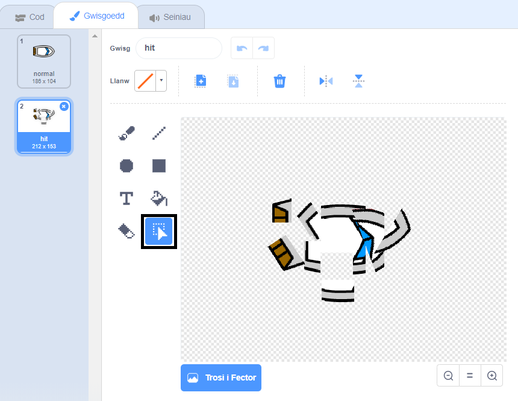

## Llongddrylliad!

Mae dy gwch dal yn gallu hwylio trwy’r pren! Fe wnawn ni drwsio hyn.

--- task ---

Fe fydd angen 2 wisg ar dy gwch, un normal, ac un ar gyfer pan mae’r cwch yn taro’r pren. Dyblyga gwisg y cwch, a galw nhw yn ‘normal’ a ‘wedi torri’.

--- /task ---

--- task ---

Clicia ar dy wisg ‘wedi torri’, a dewis y teclyn **Dewis** i ddewis darnau o’r cwch a symud a’u cylchdroi nhw. Gwna’r cwch i edrych fel ei fod wedi bod mewn llongddrylliad.



--- /task ---

--- task ---

Ychwanega gôd i dy gwch fel ei fod yn torri pan mae’n cyffwrdd y darnau pren.

--- hints ---
 --- hint --- Mae angen ychwanegu blociau côd tu fewn y ddolen `am byth`{:class="block3control"} fel bod dy gôd yn cadw gwirio os yw'r cwch wedi chwalu, mae angen i'r côd ail-osod safle'r cwch.

`os`{:class="block3control"} yw'r cwch yn `cyffwrdd`{:class="block3sensing"} lliw brown y pren, mae angen `newid i'r wisg wedi taro`{:class="block3looks"}, `a dweud Naaa! am ddwy eiliad`{:class="block3looks"}, yna `newid i wisg normal`{:class="block3looks"}. Yn olaf, bydd angen `pwyntio fyny`{:class="block3motion"} a `mynd i'r man cychwyn`{:class="block3motion"}.

--- /hint --- --- hint --- Dyma'r blociau côd rwyt ti eu hangen: 

```blocks3
os <cyffwrdd lliw [ ] ?> yna
end

mynd i x: (-190) y: (-150)

newid gwisg i (hit v)

pwyntio i gyfeiriad (0)

newid gwisg i (normal v)

dweud [Naaa!] am (2) eiliad
```

--- /hint --- --- hint --- Dyma sut ddylai dy gôd edrych: 

```blocks3
pan fo'r flag werdd yn cael ei glicio
pwyntio i gyfeiriad (0)
mynd i x: (-190) y: (-150)
am byth 
  os &lt;(pellter i (pwyntydd llygoden v)) &gt; [5]&gt; yna 
    pwyntio tuag at (pwyntydd llygoden v)
    symud (1) cam
  end
  os <cyffwrdd lliw [#663b00] ?> yna 
    newid gwisg i (hit v)
    dweud [Naaa!] am (2) eiliad
    newid gwisg i (normal v)
    pwyntio i gyfeiriad (0)
    mynd i x: (-190) y: (-150)
  end
end
```

--- /hint ------ /hints ---

--- /task ---

--- task ---

Fe ddylet ti hefyd ychwanegu côd i sicrhau bod corlun dy gwch bob tro yn cychwyn yn edrych yn 'normal'.

Profa dy gôd eto. Os wyt ti'n llywio'r cwch trwy'r pren nawr, fe ddylai dy gwch gael llongddrylliad ac yna symud yn ôl i'r man cychwyn.


--- /task ---