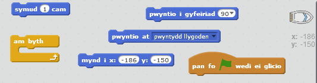

## Rheoli'r cwch

\--- task \---

Byddi di'n rheoli'r cwch â'th lygoden di. Ychwanega god at dy gwch fel ei fod yn cychwyn o'r gornel chwith isaf gan bwyntio i fyny ac yna'n dilyn pwyntydd y llygoden. **Profa dy god** er mwyn sicrhau ei fod yn gwneud yr hyn y dylai.

\--- hints \--- \--- hint \--- Ar ôl i ti `bwyso'r faner werdd`, bydd angen i ti `anfon y cwch i'r safle cychwyn` a'i `bwyntio i fyny`. Next it will need to `point towards the mouse pointer` and `move 1 step`. It will need to repeat this `forever`.

\--- /hint \--- \--- hint \--- Here are the code blocks you'll need:  \--- /hint \--- \--- hint \--- This is what your code should look like:  \--- /hint \--- \--- /hints \---

\--- /task \---

\--- task \---

Test out your boat by clicking the flag and moving the mouse. Does the boat sail towards the mouse?

## \--- collapse \---

title: If you have problems ...

## image: images/image.png

**Note:** There is currently a bug in Scratch which means your boat may not move towards the mouse pointer. If this happens, click the arrow on the `point towards` block and re-select `mouse-pointer`.

 \--- /collapse \---

\--- /task \---

\--- task \---

What happens if the boat reaches the mouse pointer? Try it.

\--- /task \---

\--- task \---

To stop this from happening, you'll need to add an `if` block to your code, so that the boat only moves if it is more than 5 pixels away from the mouse.

\--- hints \--- \--- hint \--- The boat should only point towards the mouse pointer and move `if` the `distance to the mouse pointer` is `greater than 5 pixels`. \--- /hint \--- \--- hint \--- Here are the code blocks you'll need to add to the code for the boat:  \--- /hint \--- \--- hint \--- This is what your code should look like:  \--- /hint \--- \--- /hints \---

\--- /task \---

\--- task \---

Test out your boat again to check whether the problem has been fixed.

\--- /task \---