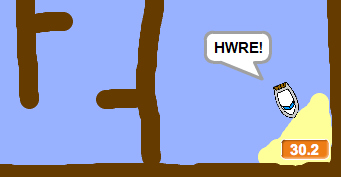

## Ychwanegu Amserydd

Fe awn ati i ychwanegu cloc i dy gêm i annog y chwareuwr i gyrraedd yr ynys mor gyflym â phosib.

\--- task \---

Ychwanega newidyn newydd o’r enw `amser`{:class="block3variables"} i dy Lwyfan.


[[[generic-scratch3-add-variable]]]

Mae modd i ti hefyd newid sut mae dy newidyn newydd yn edrych.

\--- /task \---

\--- task \---

Ychwanega blociau côd i dy lwyfan, fel fod y cloc yn cyfrif fyny nes bod y cwch yn cyrraedd yr ynys.

\--- hints \--- \--- hint \--- Ar y llwyfan `pan fo'r faner werdd wedi ei chlicio`{:class="block3control"}, `gosod yr amser i 0`{:class="block3variables"}. O fewn dy ddolen `am byth`{:class="block3control"} bydd angen i ti yn gyntaf`aros 0.1 eiliad`{:class="block3control"}, yna `newid yr amser wrth 0.1`{:class="block3variables"}. \--- /hint \--- \--- hint \--- Dyma'r blociau côd rwyt ti eu hangen: 

```blocks3
change [time v] by (0.1)

when flag clicked

forever
end

wait (0.1) seconds

set [time v] to [0]
```

\--- /hint \--- \--- hint \--- Dyma sut ddylai dy gôd edrych: 

```blocks3
when flag clicked
set [time v] to [0]
forever
wait (0.1) seconds
change [time v] by (0.1)
end
```

\--- /hint \--- \--- /hints \---

\--- /task \---

\--- task \---

Profa dy gêm i weld pa mor gyflym alli di gael y cwch i'r ynys!



\--- /task \---