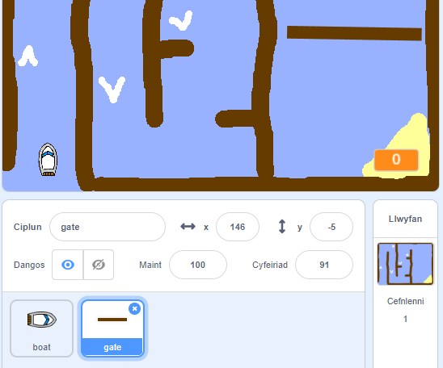
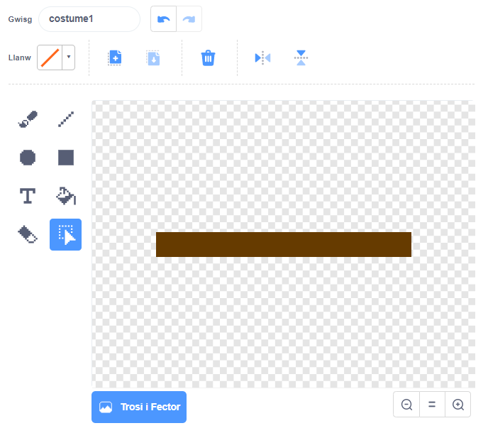
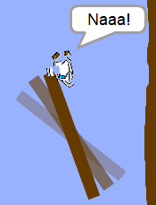

## Rhwystrau a chyflymu'r cwch

Mae’r gêm yma **llawer** rhy hawdd - awn ati i ychwanegu pethau i’w wneud yn fwy diddorol.

Yn gyntaf, fe wnawn ni ychwanegu ‘hwb’ i dy gêm, fydd yn cyflymu’r cwch.

\--- task \---

Golyga cefndir dy lwyfan ac ychwanega arwyddion gwyn.


\--- /task \---

\--- task \---

Fe alli di nawr ychwanegu côd i’r ddolen `am byth`{:class="block3control"}, fel ei fod yn symud 3 cam ychwanegol pan mae’n cyffwrdd arwydd gwyn. 

```blocks3
if <touching color [#FFFFFF] ?> then
move (3) steps
end
```

\--- /task \---

\--- task \---

Profa dy gêm i weld os yw'r cwch yn cyflymu pan mae'n taro'r arwyddion gwyn.

\--- /task \---

Nesaf fe fyddi di'n ychwanegu gât sy’n cylchdroi sy'n rhaid i dy gwch ei osgoi.

\--- task \---

Ychwanegu gorlun newydd sy'n edrych fel hyn, a'i alw'n 'gât':



Gwna’n siwr fod lliw dy gât yr un peth â’r pren.

\--- /task \---

\--- task \---

Sicrha fod canol corlun y gât wedi'i leoli yn y canol.



\--- /task \---

\--- task \---

Ychwanega gôd i'r gât i wneud iddo droi'n araf am byth.

\--- hints \--- \--- hint \--- Ychwanega blociau côd i'r corlun gât fel ei fod yn `troi 1 gradd`{:class="block3motion"} `am byth`{:class="block3control"}. \--- /hint \--- \--- hint \--- Dyma'r blociau côd rwyt ti eu hangen: 

```blocks3
forever
end

turn cw (1) degrees

when flag clicked
```

\--- /hint \--- \--- hint \--- Dyma sut ddylai dy gôd edrych: 

```blocks3
when flag clicked
forever
turn cw (1) degrees
end
```

\--- /hint \--- \--- /hints \---

\--- /task \---

\--- task \---

Profa dy gêm eto. Fe ddylet ti nawr gael gât sy’n cylchdroi sy’n rhaid i ti ei osgoi.



\--- /task \---