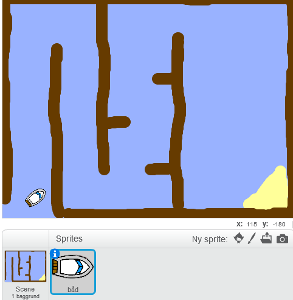

## Kom i gang

\--- opgave \--- Åbn startprojektet.

**Online:** Åbn online starterprojektet på [rpf.io/boat-race-starter-on](http://rpf.io/boat-race-starter-on){: target = "_ blank"}.

Hvis du har en Scratch-konto, kan du lave en kopi ved at klikke på **Remix**.

**Offline:** download offline starter-projektet fra [rpf.io/p/en/boat-race-go](http://rpf.io/p/en/boat-race-go){: target = "_ blank"}, og åbn det derefter ved hjælp af offline-editoren.

Hvis du skal downloade og installere Scratch offline editoren, kan du finde den på [rpf.io/scratchoff](http://rpf.io/scratchoff). \--- / opgave \---

\--- task \---

Projektet omfatter en bådsprite og et løbskursus med:

- Træ, at båden sprite skal undgå
- En ørkenø, som båden skal nå
    
    

\--- /task \---