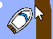
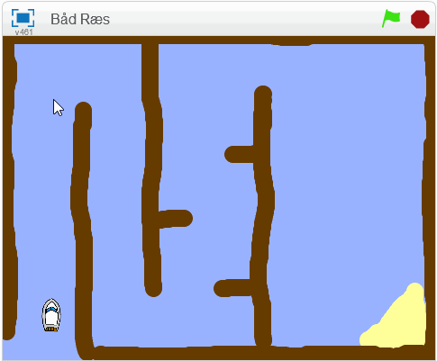

## Styring af båden

Spilleren vil styre båden sprite med musen.

\--- opgave \--- Tilføj kode til båden sprite, så den starter i nederste venstre hjørne pegende op og derefter følger musemarkøren.


```blocks3
når flag klikker
point i retning (0)
Gå til x: (-190) y: (-150)
evigt
point mod (musemarkør v)
træk (1) trin
```

\--- /task \---

\--- task \---

**Test din kode** ved at klikke på det grønne flag og flytte musen. Flytter bådens sprite mod musemarkøren?



\--- no-print \---  \--- / no-print \---

\--- kun print \---  \--- / kun print

\--- /task \---

\--- task \---

Hvad sker der, når båden når musemarkøren? Prøv det ud for at se, hvad problemet er.

\--- /task \---

\--- task \---

For at stoppe dette sker, skal du tilføje en `hvis`{: class = "block3control"} blokerer for din kode, så bådsprite kun bevæger sig, hvis den er mere end 5 pixels væk fra musemarkøren.

\--- tip \--- \--- tip \--- Båden skal kun pege mod musemarkøren og flytte `hvis`{: class = "block3control"} `afstanden til musemarkøren`{: class = "block3sensing"} er `større end 5 pixel`{: class = "block3operators"}. \--- / hint \--- \--- hint \--- Dette er de kodeblokke du skal tilføje til koden for båden sprite: 

```blocks3
hvis < [] > [] > derefter

(afstand til (musemarkør v))
```

\--- / hint \--- \--- tip \--- Dette er, hvad din kode skal se ud: 

```blocks3
når flag klikker
point i retning (0)
Gå til x: (-190) y: (-150)
evigt
hvis <(afstand til (musemarkør v)) > [5]> derefter
punkt mod peger v)
træk (1) trin
```

\--- /hint \--- \--- /hints \---

\--- /task \---

\--- task \---

Test din kode igen for at kontrollere, om problemet er nu løst.

\--- /task \---