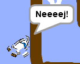

## Sammenstød!

I øjeblikket kan bådens sprite simpelthen sejle gennem træbarriererne! Du skal rette det nu.

\--- task \---

Du har brug for to kostumer til din bådsprite: et normalt kostume, og en til, når båden går i stykker. Dupliker dit bådsprit kostume, og navngiv et kostume 'normal' og det andet 'hit'.

\--- /task \---

\--- task \---

Klik på dit "hit" kostume, og brug **Select** værktøjet til at få fat i stykker af kostume og flyt og drej dem for at få båden til at se ud som om den er styrtet i stykker.


\--- /task \---

\--- task \---

Tilføj nu kode til din båd, så den nedbrud og bryder op, når det berører eventuelle brune træbarrierer.

\--- hints \--- \--- hint \---

You need to add code blocks inside your `forever`{:class="block3control"} loop so that your code keeps checking if the boat sprite has crashed, and if it has crashed, the code needs to reset the boat sprite's position.

`if`{:class="block3control"} the boat is `touching`{:class="block3sensing"} the brown colour of the wood, you need to `switch to the hit costume`{:class="block3looks"}, `say Noooo! for 2 seconds`{:class="block3looks"}, and then `switch back to the normal costume`{:class="block3looks"}. Finally, you'll need to `point up`{:class="block3motion"} and `go to the start position`{:class="block3motion"}.

\--- /hint \--- \--- hint \---

Here are the code blocks you need:


```blocks3
hvis <touching color [ ] ?> så
slut

gå til x: (-190) y: (-150)

skift kostume til (hit v)

point i retning (0)

skift kostume til (normal v)

siger [Noooooo!] for (2) sekunder
```

\--- /hint \--- \--- hint \---

Here's what your code should look like:


```blocks3
når flag klikker
point i retning (0)
Gå til x: (-190) y: (-150)
evigt
hvis <(afstand til (musemarkør v)) > [5]> derefter
punkt mod pointer v)
træk (1) trin
ende
, hvis <touching color [#663b00] ?> derefter
switch kostume til (hit v)
sige [Noooooo!] for (2) sekunder
switch kostume til (normal v)
point i retning (0)
gå til x: (-190) y: (-150)
ende
```

\--- /hint \--- \--- /hints \---

\--- /task \---

\--- task \---

You should also add code to make sure that your boat sprite always starts out looking 'normal'.

Test your code again. If you try to sail the boat through a wooden barrier now, the boat should crash and then move back to its starting position.



\--- /task \---