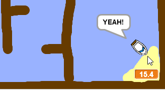

## Tilføjelse af en timer

Nu vil du tilføje en timer til dit spil, så spilleren skal komme til øen så hurtigt som muligt.

\--- task \---

Tilføj en ny variabel kaldet `time`{: class = "block3variables"} til dit trin.


[[[generic-scratch3-add-variable]]]

Du kan også vælge et kig efter din timer ved at ændre, hvordan din nye variabel vises.

\--- /task \---

\--- task \---

Tilføj nu kodeblokke til dit trin, så timeren tæller indtil båden når øen.

\--- hints \--- \--- hint \---

On the Stage, `when the green flag is clicked`{:class="block3control"}, `set the time to 0`{:class="block3variables"}. Inside your `forever`{:class="block3control"} loop, you'll need to first `wait 0.1 secs`{:class="block3control"}, then `change the time by 0.1`{:class="block3variables"}.

\--- /hint \--- \--- hint \---

Here are the code blocks you'll need:


```blocks3
ændre [tid v] med (0,1)

når flag klikket

evigt
slut

vente (0,1) sekunder

sæt [tid v] til [0]
```

\--- /hint \--- \--- hint \---

Here's what your new code should look like:


```blocks3
når flag klikket
sæt [tid v] til [0]
evigt
vent (0,1) sekunder
skift [tid v] af (0,1)
ende
```

\--- /hint \--- \--- /hints \---

\--- /task \---

\--- task \---

Test out your game and see how quickly you can get the boat to the island!



\--- /task \---