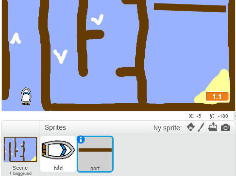
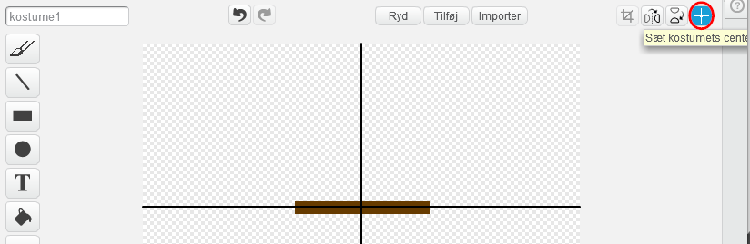
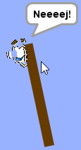

## Forhindringer og boostere

Lige nu er spillet **langt** for nemt, så du vil tilføje nogle ting for at gøre det mere interessant.

For det første vil du tilføje nogle boostere for at fremskynde båden.

\--- task \---

Rediger din scene baggrund ved at tilføje i nogle hvide booster pile.


\--- /task \---

\--- task \---

Tilføj nu flere kodeblokke til din båds `evigt`{: class = "block3control"} løkke, så bådesprite bevæger tre ekstra trin, når den rører en hvid pil. 

```blocks3
hvis <touching color [#FFFFFF] ?> så
bevæger sig (3) trin
slutter
```

\--- /task \---

\--- task \---

Test dit spil for at se om dine nye boosterpile hurtigere bådene.

\--- /task \---

Dernæst tilføjer du en spinderport, som båden skal undgå.

\--- task \---

Tilføj et nyt sprite, der ligner dette, og kalder det 'gate':



Sørg for, at portens sprite farve er den samme som træbarriens farve.

\--- /task \---

\--- task \---

Sørg for, at midten af portens sprite er placeret i midten.



\--- /task \---

\--- task \---

Tilføj kode til din gate sprite for at gøre det spin langsomt for evigt.

\--- tip \--- \--- tip \--- Tilføj kodeblokke til gate sprite, så det `bliver 1 grad`{: class = "block3motion"} `evigt`{: class = "block3control"} . \--- / hint \--- \--- hint \--- Her er de kodeblokke du har brug for: 

```blocks3
for evigt
ende

drej cw (1) grader

når flag klikkes
```

\--- / hint \--- \--- tip \--- Her er, hvad din nye kode skal se ud: 

```blocks3
når flag klikker
evigt
drej cw (1) grader
ende
```

\--- /hint \--- \--- /hints \---

\--- /task \---

\--- task \---

Test dit spil igen. Du skal nu have en spindelport, som du skal røre din båd rundt.



\--- /task \---