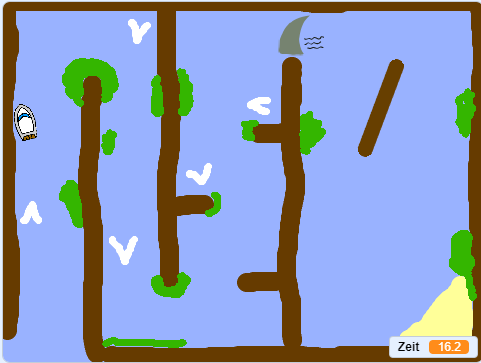

\--- no-print \---

Dies ist die ** Scratch 3 ** Version des Projekts. Es gibt auch eine [ Scratch-2-Version des Projekts ](https://projects.raspberrypi.org/en/projects/boat-race-scratch2).

\--- /no-print \---

## Einleitung

In diesem Beispiel lernst du wie man ein Rennspiel erstellt. Der Spieler verwendet dabei die Computermaus um das Boot zur Insel zu navigieren, ohne dabei in die Hindernisse zu fahren.

### Was du machen wirst

\--- no-print \---

  <iframe allowtransparency="true" width="485" height="402" src="https://scratch.mit.edu/projects/embed/276662533/?autostart=false" frameborder="0" scrolling="no"></iframe>
  

\--- /no-print \---

\--- print-only \---  \--- /print-only \---

## \--- collapse \---

## title: Was du brauchen wirst

### Hardware

Ein Computer, auf dem Scratch 3 ausgeführt werden kann

### Software

Scratch 3 (entweder [online](https://rpf.io/scratchon){:target="_blank"} oder [offline](https://rpf.io/scratchoff){:target="_blank"})

### Downloads

Downloads findest du [hier](http://rpf.io/p/en/boat-race-go){:target="_blank"}. \--- /collapse \---

## \--- collapse \---

## title: Was du lernen wirst

- Verwende in Scratch Operatoren um Zahlen miteinander zu vergleichen
- Füge Code hinzu, der überprüft, ob eine Figur eine bestimmte Farbe berührt
- Verwende eine Variable, die dir die benötigte Zeit in Scratch anzeigt \--- /collapse \---

## \--- collapse \---

## title: Zusatzinformationen für Lehrerinnen und Lehrer

Wenn du dieses Projekt ausdrucken möchtest, verwende hierfür die [druckbare Version](https://projects.raspberrypi.org/en/projects/boat-race/print){:target="_blank"}.

Du findest das [abgeschlossene Projekt hier](http://rpf.io/p/en/boat-race-get){:target="_blank"}.

\--- /collapse \---

