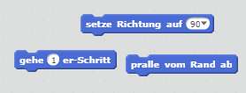
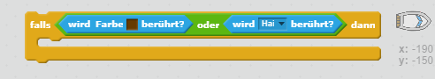

--- challenge ---

## Herausforderung: Noch mehr Hindernisse!

Kannst du mehr Hindernisse in dein Spiel einbauen? Hier sind ein paar Ideen:

--- task ---

Du könntest dein Bühnenbild mit grünem Schleim ergänzen und das Spiel so verändern, dass der Schleim das Boot verlangsamt wenn der Spieler nicht aufpasst und die beiden einander berühren.

--- hints --- --- hint --- Du kannst einen `warte`-Block benutzen, um das zu tun:  --- /hint --- --- /hints ---

--- /task ---

--- task ---

Du könntest einen beweglichen Gegenstand wie z.B. einen Baumstamm oder einen Hai einbauen!

--- hints --- --- hint --- Diese Blöcke könnten dir helfen, deinen neuen Gegenstand zu bewegen:

Wenn dein neuer Gegenstand nicht braun ist, musst du deinen Boots-Code folgendermaßen ergänzen:

 --- /hint --- --- /hints ---

--- /task ---

--- /challenge ---
