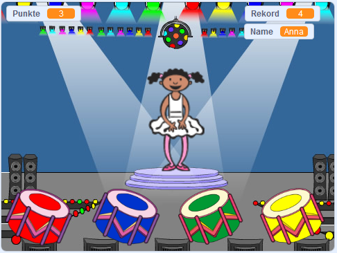

## Wie geht es weiter?

Herzlichen Glückwunsch zum Abschluss des "Boot Rennen"-Projekts! Möchtest du etwas noch herausfordernderes machen?

Probiere doch das Project [Gedächtnis-Training](https://projects.raspberrypi.org/en/projects/memory?utm_source=pathway&utm_medium=whatnext&utm_campaign=projects) aus.

\--- no-print \--- Klicke zum Starten auf die grüne Flagge. Beobachte die Farbenfolge, die das Kleid des Tänzers zeigt und höre den begleitenden Trommelschlägen zu, wiederhole anschließend diese Reihenfolge um ein Level weiter zu kommen. Wenn du die Reihenfolge der Farben falsch eingegeben hast, ist das Spiel vorbei!

  <iframe allowtransparency="true" width="485" height="402" src="//scratch.mit.edu/projects/embed/284452634/?autostart=false" frameborder="0" allowfullscreen scrolling="no" mark="crwd-mark"></iframe> 

\--- /no-print \---

\--- print-only \---  \--- /print-only \---