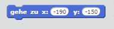
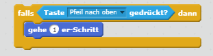

--- challenge ---

## Herausforderung: Mehr Boote!

Kannst du aus deinem Spiel ein Rennen zwischen 2 Spielern machen? Der zweite Spieler muss sein Boot mit den Pfeiltasten steuern - nach oben für vorwärts und nach rechts und links zur Seite.

--- hints --- --- hint --- Kopiere das Boot und ändere die Farbe von Boot2.

 --- /hint --- --- hint --- Ändere diesen Code, damit die zwei Boote von verschiedenen Positionen aus starten:

 --- /hint --- --- hint --- Lösche für Boot2 den Code mit der Maussteuerung und ersetze ihn mit Code, um Boot2 mit den Pfeiltasten zu steuern. --- /hint --- --- hint --- Hier steht der Code, den du brauchen wirst, um Boot2 vorwärts zu bewegen:

 --- /hint --- --- hint --- Du wirst auch Code brauchen, um das Boot zu *drehen* wenn die linke- und rechte Pfeiltaste gedrückt werden. --- /hint --- --- /hints ---

--- /challenge ---