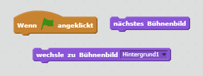

 [Offline Completed Project](resources/BoatRace-Finished.sb2){:download='BoatRace-Finished.sb2'}
 [Online Completed Project](http://scratch.mit.edu/projects/228023140/#editor){:target="_blank"}

--- challenge ---

## Herausforderung: Weitere Levels!

Kannst du mehr Bühnenbilder entwerfen und es dem Spieler ermöglichen, zwischen verschiedenen Levels zu wählen?

--- hints --- --- hint ---  --- /hint --- --- /hints ---

--- /challenge ---
***
### Von der Community übersetzt

Dieses Projekt wurde von **Ilja Gendler/Alex Nice/Oleg Bascurov** übersetzt und von **Thorsten Billib** überprüft. 

Unsere großartigen Freiwilligen helfen uns, Kindern auf der ganzen Welt die Möglichkeit zu geben, coden zu lernen. Sie können uns helfen, mehr Kinder zu erreichen, indem Sie unsere Projekte übersetzen - lesen Sie mehr unter [rpf.io/translators](https://rpf.io/translators).
