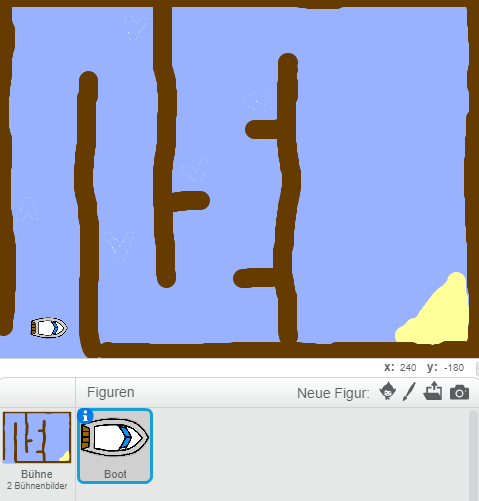

## Erste Schritte

\--- task \---

Öffne das Anfängerprojekt.

## \--- collapse \---

title: Ich benutze Scratch online

## image: images/image.png

Öffne das Scratch-Anfängerprojekt "Bootsrennen" unter [jumpto.cc/boat-go](https://scratch.mit.edu/projects/63958014/#editor){:target="_blank"}. \--- /collapse \---

## \--- collapse \---

title: Ich benutze Scratch offline

## image: images/image.png

Lade das Scratch-Anfängerprojekt "Bootsrennen" unter [jumpto.cc/boat-get](http:jumpto.cc/boat-get){:target="_blank"} herunter und öffne es dann offline mit dem Scratch-Editorprogramm. \--- /collapse \---

\--- /task \---

\--- task \---

The project includes a boat sprite and a course backdrop with:

- Wood that your boat has to avoid
- A desert island that your boat has to get to
    
    

\--- /task \---