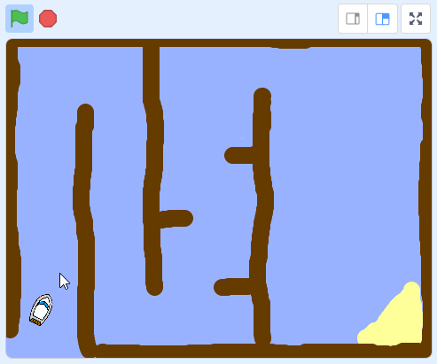

## Das Boot steuern

Der Spieler steuert das Boot mit der Computermaus.

\--- task \--- Füge deinem Boot-Sprite Code hinzu, der das Boot von der linken unteren Ecke mit Fahrtrichtung nach oben starten lässt und anschließend dem Mauspfeil folgt.


```blocks3
when flag clicked
point in direction (0)
go to x: (-190) y: (-150)
forever
point towards (mouse-pointer v)
move (1) steps
```

\--- /task \---

\--- task \---

**Teste deinen Code** indem du auf die grüne Flagge klickst und die Maus bewegst. Bewegt sich das Boot in Richtung Mauszeiger?


\--- no-print \---  \--- /no-print \---

\--- print-only \---  \--- /print-only \---

\--- /task \---

\--- task \---

Was passiert, wenn das Boot deinen Mauszeiger erreicht? Versuche herauszufinden welches Problem dabei auftritt.

\--- /task \---

\--- task \---

Um dies zu vermeiden, musst du deinem Code einen `falls`{:class="block3control"} -Block hinzufügen, sodass sich das Boot nur dann bewegt, wenn es mindestens 5 Pixel vom Mauszeiger entfernt ist.

\--- hints \--- \--- hint \--- Das Boot sollte immer in Richtung Mauszeiger zeigen und sich nur bewegen `falls`{:class="block3control"} der `Abstand zum Mauszeiger`{:class="block3sensing"} `größer als 5 Pixel`{:class="block3operators"} ist. \--- /hint \--- \--- hint \--- Hier sind die Programmblöcke, die du Programmcode des Bootes hinzufügen musst: 

```blocks3
if < [ ] > [ ] > then

(distance to (mouse-pointer v))
```

\--- /hint \--- \--- hint \--- So sollte dein Programmiercode aussehen: 

```blocks3
when flag clicked
point in direction (0)
go to x: (-190) y: (-150)
forever
if <(distance to (mouse-pointer v)) > [5]> then
point towards (mouse-pointer v)
move (1) steps
```

\--- /hint \--- \--- /hints \---

\--- /task \---

\--- task \---

Teste deinen Code erneut und überprüfe, ob das Problem nun gelöst ist.

\--- /task \---