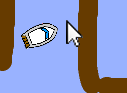
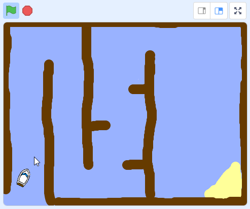

## Das Boot steuern

Der Spieler steuert das Boot mit der Computermaus.

--- task --- Füge deinem Boot-Sprite Code hinzu, so dass das Boot von der linken unteren Ecke mit Fahrtrichtung nach oben startet und dann dem Mauspfeil folgt.


```blocks3
when flag clicked
point in direction (0)
go to x: (-190) y: (-150)
forever 
  point towards (Mauszeiger v)
  move (1) steps
end
```

--- /task ---

--- task ---

**Teste deinen Code** indem du auf die grüne Flagge klickst und die Maus bewegst. Bewegt sich der Boot-Sprite in Richtung Mauszeiger?



--- no-print --- 
 
--- /no-print ---

--- print-only --- 
 
--- /print-only ---

--- /task ---

--- task ---

Was passiert, wenn das Boot deinen Mauszeiger erreicht? Probier es aus, um herauszufinden wo das Problem liegt.

--- /task ---

--- task ---

Um dies zu vermeiden, musst du deinem Code einen `falls`{:class="block3control"} Block hinzufügen, sodass sich der Boot-Sprite nur dann bewegt, wenn es mindestens 5 Pixel vom Mauszeiger entfernt ist.

--- hints ---
 --- hint --- Das Boot sollte immer in Richtung Mauszeiger zeigen und sich nur bewegen `falls`{:class="block3control"} der `Abstand zum Mauszeiger`{:class="block3sensing"} `größer als 5 Pixel`{:class="block3operators"} ist.
--- /hint ---
 --- hint --- Hier sind die Programmblöcke, die du Programmcode des Boot-Sprites (Boot Figur) hinzufügen musst: 

```blocks3
if <[ ] > [ ]> then
end

(Entfernung von (Mauszeiger v))
```

--- /hint --- --- hint --- So sollte dein Programmcode aussehen: 

```blocks3
when flag clicked
point in direction (0)
go to x: (-190) y: (-150)
forever 
  if <(distance to (Mauszeiger v)) > [5]> then 
    point towards (Mauszeiger v)
    move (1) steps
```

--- /hint --- --- /hints ---

--- /task ---

--- task ---

Teste deinen Code erneut und überprüfe, ob das Problem nun gelöst ist.

--- /task ---
