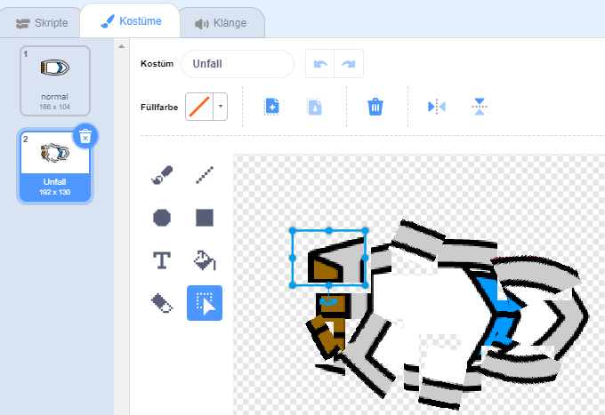

## Einen Unfall bauen!

Im Moment kann dein Boot einfach durch die hölzernen Hindernisse segeln! Reparieren wir das.

\--- task \---

Du brauchst zwei Kostüme für dein Boot, ein normales Kostüm und eins, wenn das Boot einen Unfall hat. Dupliziere dein Bootskostüm und nenne ein Kostüm "normal" und das andere "Unfall".

\--- /task \---

\--- task \---

Klicke auf das "**Unfall**" -Kostüm und wähle den Befehlen **Auswählen** aus, um Teile des Kostüms zu ergreifen, zu bewegen und zu drehen. Das Boot soll am Ende total kaputt aussehen.



\--- /task \---

\--- task \---

Jetzt füge deinem Boot neuen Code hinzu, so dass es auseinander bricht, sobald es braune Holzteile berührt.

\--- hints \--- \--- hint \---

Du musst dem Code zu deiner `wiederhole fortlaufend` {: class = "block3control"}-Schleife hinzufügen, damit er immer wieder prüft, ob das Boot einen Unfall hat. In diesem Fall muss der Code die Position der Boots-Figur zurück setzen.

`wenn`{:class="block3control"} das Boot die braune Farbe des Holzes `berührt`{:class="block3sensing"}, musst du `zum Unfall-Kostüm wechseln`{:class="block3looks"}, ` und Oh nein!  für 2 Sekunden`{:class="block3look"} sagen, und anschließend `zurück zum normalen Kostüm wechseln`{:class="block3look"}. Als letztes musst du das Köstum `nach oben`{:class="block3motion"} zeigen lassen und `zur Startposition gehen`{:class="block3motion"}.

\--- /hint \--- \--- hint \---

Hier sind die Codeblöcke, die du brauchst:


```blocks3
falls <touching color [ ] ?> dann
ende

gehe zu x: (-190) y: (-150)

wechsle zu Kostüm (Unfall v)

setze Richtung auf (0) Grad

wechsle zu Kostüm (normal v)

sage [Oh nein!] für (2) Sekunden
```

\--- /hint \--- \--- hint \---

Here's what your code should look like:


```blocks3
Wenn grüne Flagge angeklickt wird
setze Richtung auf (0) Grad
gehe zu x: (-190) y: (-150)
wiederhole fortlaufend
wenn <(Entfernung von (Mauszeiger v)) > [5]> dann
drehe dich zu (Mauszeiger v)
gehe (1) er Schritt
ende
wenn <touching color [#663b00] ?> dann
wechsle zu Kostüm (Unfall v)
sage [Oh nein!] für (2) Sekunden
wechsle zu Kostüm (normal v)
setze Richtung auf (0) Grad
geh zu x: (-190) y: (-150)
ende
```

\--- /hint \--- \--- /hints \---

\--- /task \---

\--- task \---

You should also add code to make sure that your boat sprite always starts out looking 'normal'.

Test your code again. If you try to sail the boat through a wooden barrier now, the boat should crash and then move back to its starting position.


\--- /task \---