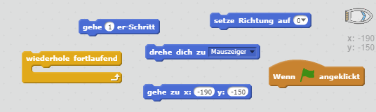
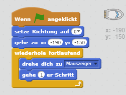
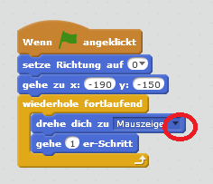
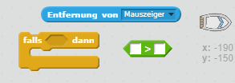
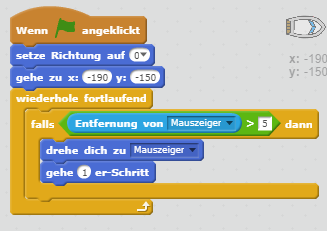

## Das Boot steuern

--- task ---

Du wirst das Boot mit der Maus steuern. Füge deiner Bootsfigur Code hinzu, so dass sie in der unteren linken Ecke nach oben zeigend losfährt und dann dem Mauszeiger folgt. **Probiere deinen Code aus** um sicherzustellen, dass er tut was er soll.

--- hints --- --- hint --- Du wirst dein Boot, sobald die `grüne Flagge angeklickt wird`, `zur Startposition gehen` lassen und die `Richtung auf oben setzen` müssen. Als nächstes muss es `sich zum Mauszeiger drehen` und einen `1 er-Schritt gehen`. Das muss es `fortlaufend wiederholen`.

--- /hint --- --- hint --- Hier sind die Code-Blöcke, die du brauchen wirst:  --- /hint --- --- hint --- So sollte dein Code aussehen:  --- /hint --- --- /hints ---

--- /task ---

--- task ---

Probiere dein Boot aus, indem du die grüne Flagge anklickst und die Maus bewegst. Fährt das Boot dem Mauszeiger hinterher?

--- collapse ---
---
title: Wenn du Probleme hast...
---
image: images/image.png

**Note:** Es gibt momentan einen Fehler in Scratch, der dazu führt, dass dein Boot sich vielleicht nicht in Richtung des Mauszeigers bewegt. In diesem Fall klicke den Pfeil auf dem `drehe dich zu` Block und wähle erneut `Mauszeiger`.

 --- /collapse ---

--- /task ---

--- task ---

Was passiert, wenn das Boot den Mauszeiger erreicht? Probiere es aus.

--- /task ---

--- task ---

Um dies zu verhindern, musst du einen `falls`-Block zu deinem Code hinzufügen, damit das Boot sich nur dann bewegt, wenn es mehr als 5 Pixel vom Mauszeiger entfernt ist.

--- hints --- --- hint --- Das Boot sollte nur auf den Mauszeiger zeigen und sich bewegen `falls` die `Entfernung vom Mauszeiger` `größer als 5 Pixel` ist. --- /hint --- --- hint --- Hier sind die Code-Blöcke, die du dem Code für das Boot hinzuzufügen musst:  --- /hint --- --- hint --- So sollte dein Code aussehen:  --- /hint --- --- /hints ---

--- /task ---

--- task ---

Probiere dein Boot noch einmal aus, und prüfe, ob das Problem gelöst worden ist.

--- /task ---