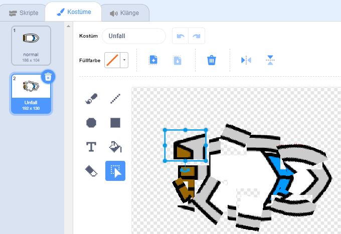
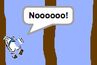

## Einen Unfall bauen!

Im Moment kann dein Boot einfach durch die hölzernen Hindernisse segeln! Reparieren wir das.

--- task ---

Du brauchst zwei Kostüme für dein Boot, ein normales Kostüm und eins, wenn das Boot einen Unfall hat. Dupliziere dein Bootskostüm und nenne ein Kostüm "normal" und das andere "Unfall".

--- /task ---

--- task ---

Klicke auf das "Unfall"-Kostüm und wähle den Befehlen **Auswählen** aus, um Teile des Kostüms zu ergreifen, zu bewegen und zu drehen. Das Boot soll am Ende total kaputt aussehen.



--- /task ---

--- task ---

Jetzt füge deinem Boot neuen Code hinzu, so dass es auseinander bricht, sobald es braune Holzteile berührt.

--- hints ---
 --- hint --- Du musst dem Code in deiner `wiederhole fortlaufend`{:class="block3control"}-Schleife ergänzen, damit er immer wieder prüft, ob das Boot einen Unfall hat. In diesem Fall muss der Code die Position der Boots-Figur zurück setzen.

`wenn`{:class="block3control"} das Boot die braune Farbe des Holzes `berührt`{:class="block3sensing"}, musst du `zum Unfall Kostüm wechseln`{:class="block3looks"}, `und Oh nein!  für 2 Sekunden`{:class="block3look"} sagen, und anschließend `zurück zum normalen Kostüm wechseln`{:class="block3look"}. Als letztes musst du das Köstum `nach oben`{:class="block3motion"} zeigen lassen und `zur Startposition gehen`{:class="block3motion"}.

--- /hint --- --- hint --- Hier sind die Codeblöcke die du brauchst: 

```blocks3
if <touching color [] ?> then
end

go to x: (-190) y: (-150)

switch costume to (Unfall v)

point in direction (0)

switch costume to (normal v)

say [Oh nein!] for (2) seconds
```

--- /hint --- --- hint --- So sollte dein Programmiercode aussehen: 

```blocks3
when flag clicked
point in direction (0)
go to x: (-190) y: (-150)
forever 
  if <(distance to (Mauszeiger v)) > [5]> then 
    point towards (Mauszeiger v)
    move (1) steps
  end
  if <touching color [#663b00] ?> then 
    switch costume to (Unfall v)
    say [Oh nein!] for (2) seconds
    switch costume to (normal v)
    point in direction (0)
    go to x: (-190) y: (-150)
  end
end
```

--- /hint --- --- /hints ---

--- /task ---

--- task ---

Du solltest auch sicherstellen, dass dein Boot zu Beginn eines Spiels immer "normal" aussieht und somit dieses Kostüm trägt.

Teste deinen Code erneut. Wenn dein Boot nun versucht durch eine hölzerne Barriere zu segeln, sollte das Boot zu dem Unfall-Look wechseln, Oh nein! sagen und anschließend zur Startpoition zurückkehren.



--- /task ---