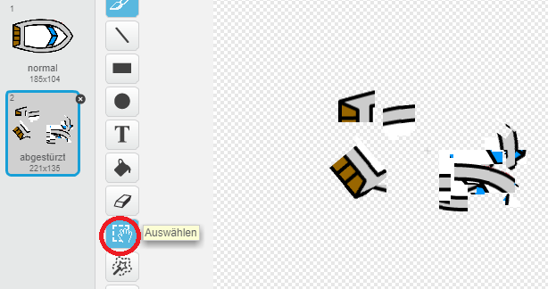
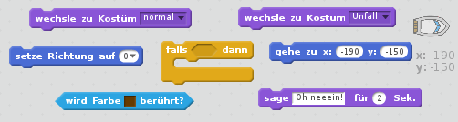
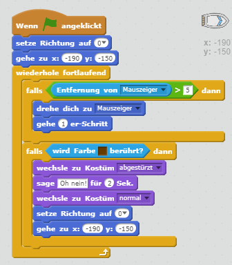
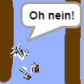

## Einen Unfall bauen!

Im Moment kann dein Boot durch die hölzernen Hindernisse hindurch fahren! Reparieren wir das.

\--- task \---

Du wirst zwei Kostüme für dein Boot brauchen, ein normales Kostüm und eins, wenn das Boot einen Unfall hat. Dupliziere dein Bootskostüm und nenne ein Kostüm "normal" und das andere "Unfall".

\--- /task \---

\--- task \---

Klicke auf das "Unfall"-Kostüm und markiere mit dem Auswählen-Tool Teile des Bootes. Ziehe sie auseinander und verdrehe sie, damit es total kaputt aussieht.

\--- /task \---

\--- task \---

Jetzt füge deinem Boot Code hinzu, der es auseinander brechen lässt, wenn es braune Holzteile berührt.

\--- hints \--- \--- hint \--- Du musst den Code in deiner `wiederhole fortlaufend`-Schleife ergänzen, damit er immer wieder prüft, ob das Boot einen Unfall hat. `Falls` das Boot das Braun des Holzes `berührt`, musst du `zum Unfall-Kostüm wechseln `, `Oh neeein! sagen für 2 Sekunden` und dann wieder `zum normalen Kostüm wechseln`. Schließlich musst du `die Richtung auf "oben" setzen` und `zur Startposition gehen`. \--- /hint \--- \--- hint \--- Hier sind die Code-Blöcke, die du brauchen wirst:  \--- /hint \--- \--- hint \--- So sollte dein Code aussehen:  \--- /hint \--- \--- /hints \---

\--- /task \---

\--- task \---

Du solltest auch sicherstellen, dass dein Boot zu Beginn eines Spiels immer "normal" aussieht.

Wenn du jetzt versuchst, durch eine Holzbarriere zu fahren, solltest du feststellen, dass dein Boot zerbricht und zur Startposition zurückkehrt.

\--- /task \---