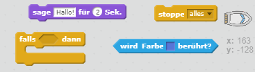
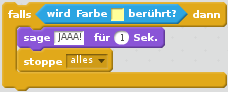

## Herausforderung: Gewinnen!

Kannst du deinem Boots-Code noch einen weiteren `falls`-Block hinzufügen, so dass der Spieler gewinnt, wenn das Boot die einsame Insel erreicht?

Wenn das Boot die gelbe einsame Insel erreicht, sollte das Spiel "JAAA!" sagen und dann enden.

--- hints --- --- hint --- Du musst deiner `wiederhole fortlaufend`-Schleife mehr Code hinzufügen, damit dein Code immer wieder prüft, ob das Spiel gewonnen worden ist. `Falls` das Boot die Farbe der Schatzinsel `berührt`, lasse es `'JAAA!' sagen für 2 Sekunden` und dann `alles stoppen`, um das Spiel zu beenden. --- /hint --- --- hint --- Hier sind die Code-Blöcke, die du brauchen wirst:  --- /hint --- --- hint --- So sollte dein Code aussehen: 

Vergiss nicht, dass der neuen Code innerhalb deiner `wiederhole fortlaufend` Schleife sein muss. --- /hint --- --- /hints ---